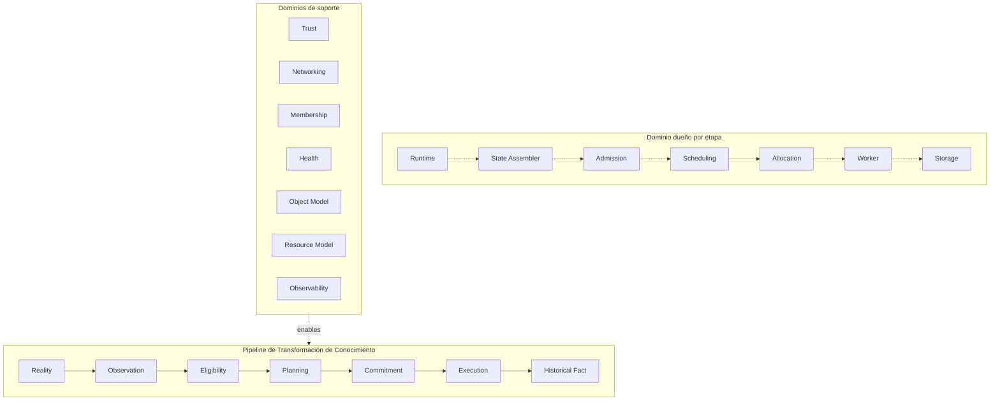
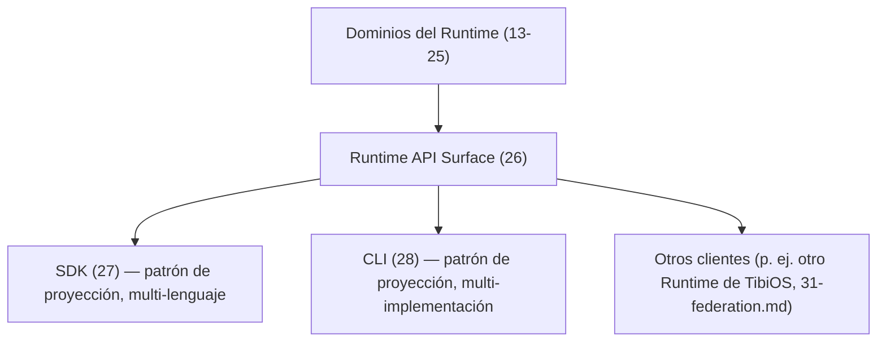
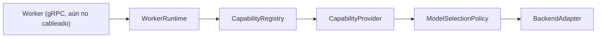
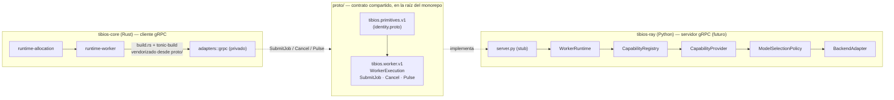

# TibiOS

TibiOS es un Runtime distribuido para orquestar cómputo — con foco particular en cargas de trabajo de IA — sobre infraestructura heterogénea. Las aplicaciones describen *qué* debe ejecutarse (un Workload); el Runtime decide *si* se admite, *dónde* se ejecuta, *cuándo* se comprometen los recursos y *cómo* se ejecuta y se observa. El Runtime en sí no es un scheduler, ni un motor de almacenamiento, ni una pila de red, ni un motor de ejecución: es la composición de todos ellos, cada uno propiedad de un dominio independiente, cableados una única vez en un Composition Root.

Este repositorio (`TibiOS/`) es el monorepo que agrupa dos proyectos hermanos que implementan ese Runtime en dos lenguajes distintos, más el contrato que los conecta:

- **`tibios-core`** — la implementación en Rust del Runtime en sí: el modelo arquitectónico completo, el workspace de Cargo, y el cliente gRPC que habla con los Workers.
- **`tibios-ray`** — un Worker de ejecución pesada de IA implementado en Python sobre Ray, que actúa como una de las implementaciones del Worker Contract que `tibios-core` define. La otra implementación es `local-infer` (en proceso, sobre llama.cpp, sin repositorio propio todavía).
- **`proto/`** — el contrato gRPC compartido, neutral respecto de lenguaje, que no pertenece a ninguno de los dos lados sino a la relación entre ambos.

Remoto de git: `https://github.com/fgparamio/tibiOS`, rama por defecto `main`.

Este documento es el punto de entrada de todo el monorepo: explica cómo encajan las piezas entre sí. Para el detalle interno de cada proyecto, los README y la documentación de arquitectura de cada subcarpeta son la fuente de verdad — este archivo resume y conecta, no reemplaza.

---

## Tabla de contenidos

1. [Estructura del monorepo](#estructura-del-monorepo)
2. [Arquitectura conceptual](#arquitectura-conceptual)
3. [Terminología esencial](#terminología-esencial)
4. [`tibios-core` en detalle](#tibios-core-en-detalle)
5. [`tibios-ray` en detalle](#tibios-ray-en-detalle)
6. [El contrato compartido (`proto/`)](#el-contrato-compartido-proto)
7. [Cómo se construye este proyecto: Spec-Driven Development](#cómo-se-construye-este-proyecto-spec-driven-development)
8. [Cómo empezar](#cómo-empezar)
9. [Dónde seguir leyendo](#dónde-seguir-leyendo)
10. [Notas para revisar](#notas-para-revisar)

---

## Estructura del monorepo

```
TibiOS/                          # monorepo raíz (remoto: fgparamio/tibiOS, rama default: main)
├── tibios-core/                 # Runtime en Rust (workspace de Cargo, 16 crates)
│   ├── crates/                  # 15 crates de dominio + runtime-primitives
│   ├── runtime/                 # crate binario — el Composition Root
│   ├── docs/architecture/       # ~31 documentos normativos + glosario + diagramas
│   ├── openspec/                # trail de Spec-Driven Development (specs, changes, archive)
│   └── proto/                   # copia vendorizada, byte-idéntica, del contrato compartido
├── tibios-ray/                  # Worker de ejecución pesada de IA en Python (Ray)
│   ├── src/tibios_ray/          # execution/, backends/, capabilities/, selection/, runtime/, testing/
│   ├── docs/architecture/       # documentación propia, acotada, de este lado del contrato
│   ├── openspec/                # trail de SDD propio (specs, changes, archive)
│   └── tests/                   # suite de tests unitarios (pytest)
└── proto/                       # contrato .proto compartido — no pertenece a ninguno de los dos lados
    └── tibios/
        ├── primitives/v1/identity.proto
        └── worker/v1/worker.proto
```

| Carpeta | Qué vive ahí | Quién la posee |
|---|---|---|
| `tibios-core/` | El Runtime: modelo arquitectónico, workspace Rust, cliente gRPC hacia los Workers | Equipo Rust / dominio del Runtime |
| `tibios-ray/` | Un Worker Contract concreto: ejecución pesada de IA vía Ray, servidor gRPC (aún no cableado) | Equipo Python / dominio de ejecución |
| `proto/` | El contrato de red entre ambos: mensajes y servicio gRPC en proto3 | Ninguno de los dos — es la relación misma |

La razón de que `proto/` viva en la raíz del monorepo y no dentro de `tibios-core/` es explícita: tanto un build de Rust como uno de Python necesitan compilar contra la misma definición congelada, sin que la cadencia de release o el tooling de ningún lenguaje se filtre en el otro. `tibios-core` mantiene además su propia copia vendorizada en `tibios-core/proto/` (ver [El contrato compartido](#el-contrato-compartido-proto)) para que sus builds sean herméticos — es decir, el `proto/` de la raíz es la fuente, y `tibios-core/proto/` es una copia consumidora, nunca al revés.

---

## Arquitectura conceptual

`tibios-core/docs/architecture/00-philosophy.md` es el documento fundacional del que derivan todos los demás. No es una lista de buenas prácticas: es el conjunto de principios de los que cada decisión de diseño posterior debería derivarse *naturalmente*. Vale la pena entenderlo con profundidad porque explica por qué el resto del sistema está organizado como está.

### Arquitectura antes que implementación

El modelo arquitectónico define el espacio de implementaciones válidas; la implementación realiza solo un subconjunto de ese espacio. Esto significa que el modelo puede — y debe — describir capacidades que todavía no existen en código: overcommit de recursos, preemption de allocations, live migration, checkpointing, políticas de scheduling avanzadas. Estos conceptos pertenecen al modelo arquitectónico porque son consecuencias naturales del modelo mismo, no features que alguien decidió agregar.

La contraparte de esto es la regla de **costo cero hasta que se usa**: describir una capacidad no implica implementarla. Una abstracción a nivel de tipos o de contrato no cuesta nada mientras no tenga un consumidor real — el costo empieza cuando se introduce comportamiento (`MigrationManager::start()`, un hilo en background), no cuando se describe una posibilidad (“Allocation soporta migración”). Esta distinción es la que le permite a `tibios-core` tener 13 de sus 16 crates como stubs intencionales sin que eso sea "deuda técnica": son posibilidad arquitectónica todavía no realizada, no trabajo pendiente mal hecho.

### Ownership (propiedad)

Este es probablemente el principio más importante para entender cómo está particionado el código. La tesis central es que la complejidad de los sistemas distribuidos — sincronización, locks, consenso, race conditions — es en general un síntoma de propiedad poco clara, no un costo inherente de la distribución.

De ahí se derivan reglas concretas:

- **Autoridad exclusiva**: todo estado mutable tiene exactamente un dueño autoritativo. Otros dominios pueden observarlo, cachearlo, derivar información — nunca modificarlo.
- **Una única fuente de verdad**: nunca existen dos representaciones autoritativas del mismo estado. Pueden existir cachés, proyecciones, índices o snapshots, pero esos son derivados, nunca reemplazos.
- **Dominios de consistencia**: cada hecho autoritativo pertenece a exactamente un dominio de consistencia; la coordinación entre dominios ocurre siempre a través de hechos publicados, nunca de estado mutable compartido.
- **Los servicios pertenecen a dominios, no a la infraestructura**: la propiedad no termina en el dato — un dominio también posee las *operaciones* que interpretan sus conceptos. La infraestructura (storage, transporte, cómputo) provee capacidad; nunca posee significado. Un servicio se ubica según de qué lenguaje habla, no según qué capa de infraestructura tiene más cerca.

### Hechos vs. observaciones

No todo el estado del Runtime tiene la misma naturaleza. El **estado autoritativo** (una decisión de admisión, un lease) no puede reconstruirse simplemente observando la realidad de nuevo — si se pierde, se pierde conocimiento irrecuperable, y por eso debe persistirse. El **estado observacional** (salud de un nodo, utilización actual) es una medición de una realidad externa que cambia constantemente — si se pierde, simplemente se vuelve a medir, y tratarlo con la misma disciplina de persistencia que a un hecho autoritativo es puro desperdicio.

Confundir estas dos categorías es, según la filosofía del proyecto, una fuente recurrente de complejidad innecesaria: persistencia de más, sincronización de más, mecanismos de recuperación sobre-diseñados.

### Propagación de estado por hechos publicados

Un dominio que posee estado publica lo que ya se volvió verdadero; otros dominios observan y reaccionan por su cuenta. Nunca mutan el estado de otro dominio directamente, y nunca publican hechos en nombre de otro dominio. Los eventos comunican hechos completados (`AllocationCreated`, `LeaseExpired`), nunca solicitan acciones (nunca `AllocateResources` o `CloseSession`) — eso es responsabilidad de los Service Contracts.

### El mapa de ~31 documentos de arquitectura

La arquitectura de `tibios-core` está congelada en **`architecture-v1.0`** (tag de git). Congelar no significa que el sistema esté construido — significa que cada pregunta arquitectónica tiene exactamente un documento normativo, y que cambiarlo después del freeze exige abrir deliberadamente una Architecture v1.1, nunca una edición casual.

| Doc | Dominio / concern |
|---|---|
| `00-philosophy.md` | Principios arquitectónicos: Ownership, Authority, State (hechos vs. observaciones), Runtime Evolution |
| `01-style.md` | Estilo de código Rust obligatorio |
| `02-project-structure.md` | Arquitectura de dependencias: layout del proyecto, Ports & Adapters, Composition Root, primitivas compartidas |
| `03-api-design.md` | Lineamientos de diseño de API pública en todos los crates |
| `04-error-handling.md` | Manejo de errores: disciplina `Result`/`Option`, clasificación de errores |
| `05-async-concurrency.md` | Async y concurrencia (ownership y paso de mensajes por sobre estado mutable compartido) |
| `06-testing.md` | Disciplina de testing y la pirámide de tests |
| `07-performance.md` | Guía de performance (Correctness → Safety → Simplicity → Performance, en ese orden) |
| `08-security.md` | Seguridad como principio de diseño: asumir entornos hostiles, seguro por defecto |
| `09-observability.md` | Observabilidad: métricas, logs y traces como concerns de primera clase |
| `10-distributed-systems.md` | Supuestos de sistemas distribuidos: la red no es confiable |
| `11-runtime.md` | El Runtime en sí: cómo cada dominio compone una única computadora lógica |
| `12-execution-model.md` | Modelo de ejecución: las aplicaciones declaran Workloads, el Runtime los transforma en ejecución |
| `13-object-model.md` | Object Model: la abstracción universal de entidad (Logical/Content Object, Physical Replica) |
| `14-resource-model.md` | Resource Model: el lenguaje del Scheduler para capacidad asignable |
| `15-allocation-model.md` | Allocation Model: asignación temporaria de capacidad de Resource a Workloads |
| `16-scheduling-engine.md` | Scheduling Engine: decisiones de placement puras vía Policies componibles |
| `17-cluster-snapshot.md` | Cluster Snapshot: observación inmutable en un punto del tiempo, usada para planificar |
| `18-worker-model.md` | Worker Model: el dominio que ejecuta Workloads (no posee nada salvo la ejecución) |
| `19-state-assembler.md` | State Assembler: convierte estado mutable del Runtime en Cluster Snapshots inmutables |
| `20-admission-control.md` | Admission Control: decisiones de elegibilidad autoritativas antes de que empiece el scheduling |
| `21-runtime-storage-engine.md` | Runtime Storage Engine: persistencia neutral a infraestructura para hechos autoritativos |
| `22-networking.md` | Networking: comunicación autenticada, Sessions, Trust, Membership, Health |
| `23-object-store.md` | Object Store: resolución de identidad de Object en contenido |
| `24-replication.md` | Replication: garantizar copias accesibles de Content Objects |
| `25-ai-runtime.md` | AI Runtime: la ejecución de IA como especialización del Runtime existente, sin primitivas nuevas |
| `26-runtime-api.md` | Runtime API: la única superficie de capacidad externa (arranca el "Bloque 2") |
| `27-sdk.md` | SDK: patrón de proyección tipada por lenguaje del Runtime API (sin crate canónico) |
| `28-cli.md` | CLI: proyección de comando humano del Runtime API (sin implementación canónica) |
| `29-deployment.md` | Deployment: si una instancia de Runtime existe, con qué configuración, por cuánto tiempo |
| `30-ai-services.md` | AI Services: composición de conceptos existentes del Runtime en capacidades de IA permanentes e invocables |
| `31-federation.md` | Federation: cooperación entre dos Runtimes de TibiOS independientes |

`GLOSSARY.md` es el índice cruzado de estos documentos — no define nada por sí mismo, solo apunta al documento que posee cada término (ver la sección siguiente para los términos más importantes).

### Diagrama: dominios del Runtime y el pipeline de transformación de conocimiento

Este es uno de los diagramas oficiales del proyecto (fuente: `tibios-core/docs/architecture/diagrams/runtime-overview.md`, git-versionado y autoritativo — cualquier forma renderizada o exportada es derivada, nunca la fuente de verdad). Agrupa cada dominio del Runtime según participe en el pipeline de transformación de conocimiento o lo sostenga:



### Diagrama: Runtime API, SDK y CLI

Fuente: `tibios-core/docs/architecture/diagrams/runtime-api-sdk-cli.md`. Es un grafo en estrella, deliberadamente — no una cadena: cada consumidor depende únicamente del Runtime API; ningún consumidor depende de otro (`Runtime API → SDK → CLI` fue explícitamente rechazado por ser una dependencia innecesariamente fuerte). Los dominios poseen el significado; `runtime-api` es el único dueño de la superficie pública.



---

## Terminología esencial

Estos son los términos que hacen falta para leer el resto de este documento (y del resto del proyecto) sin tropezar. Cada uno tiene una definición sustancial, tomada del glosario y de los documentos que la poseen — el glosario en sí no redefine nada, solo indexa.

- **Runtime** — la composición de todos los dominios; lo que convierte un conjunto de nodos "Tibi Box" independientes en una única computadora lógica. No es él mismo un scheduler ni un motor de storage: es la orquesta completa.
- **Workload** — la unidad fundamental de ejecución que el Runtime acepta. Una aplicación declara *qué* quiere ejecutar mediante un Workload; el Runtime decide todo lo demás.
- **Runtime Pipeline** — el camino que recorre un Workload: Admission → Scheduling → Allocation → Worker.
- **Object** — la abstracción universal para toda entidad que el Runtime gestiona. Se divide en **Logical Object** (una referencia mutable y versionada — `ObjectId` + `ObjectVersion`) y **Content Object** (contenido inmutable direccionado por `ContentHash`). Un **Physical Replica** es una copia física de esos bytes — un detalle de implementación, nunca la identidad misma.
- **Resource** — el lenguaje del Scheduler para describir capacidad asignable. Una **Capability** es un rasgo tipado de hardware/plataforma de un Resource o Worker (GPU, CUDA, VRAM…); la **Capacity** es la cantidad escalar observada de un Resource disponible en este momento.
- **Allocation** — la asignación temporaria de capacidad de un Resource a un Workload. El **Allocation Plan** es la propuesta de placement del Scheduler, todavía no materializada; el **Allocation Contract** son los términos inmutables y autoritativos que el Runtime se compromete a honrar una vez que la Allocation existe.
- **Scheduling Engine** — la función pura que decide dónde debería ejecutarse un Workload, componiendo **Filters** (chequeos de elegibilidad duros y booleanos) y **Scores** (rankings continuos y blandos sobre candidatos ya factibles).
- **Cluster Snapshot** — una observación inmutable del cluster en un punto del tiempo, usada para planificar; la produce el **State Assembler**, el proceso continuo que convierte la realidad mutable del Runtime en Cluster Summary y Cluster Snapshot.
- **Worker** — el dominio que ejecuta un Workload; no posee nada salvo la ejecución misma. Es el rol que cumplen tanto `local-infer` como `tibios-ray`. La **Execution Context** es el paquete inmutable que un Worker recibe para ejecutar (Workload, Allocation Contract, dependencias resueltas); el **Execution Channel** es el conducto — propiedad del Runtime — por el que un Worker emite **Execution Events** (hechos que describen la ejecución mientras ocurre); el **Execution Report** es el resumen terminal y autoritativo de una ejecución completa; el **Execution Pulse** es la señal de salud de una ejecución puntual, distinta de la salud del proceso o del nodo.
- **Admission** — el dominio que decide si un Workload puede entrar al pipeline de scheduling. El **Admission Record** es el hecho autoritativo que produce esa decisión.
- **Runtime Storage Engine** — persistencia neutral a infraestructura para hechos autoritativos. El **Authoritative Event Stream** es un log append-only por agregado; el **Content Store** es almacenamiento inmutable direccionado por hash para Content Objects.
- **Trust** — el dominio que autoriza la participación de un Node, distinto de la autenticación. La **Membership** es si un Node confiable pertenece actualmente al cluster; la **Health** es si un Node miembro puede ejecutar trabajo en este momento.
- **Object Store** y **Replication** — el Object Store resuelve la identidad de un Object en contenido concreto; Replication garantiza que existan copias accesibles de los Content Objects a través del cluster (**Replica Availability**: si una réplica existe, es alcanzable y satisface la política — nunca "consistencia").
- **Runtime API** — la única superficie de capacidad pública a través de la cual consumidores externos se dirigen al Runtime. **SDK** y **CLI** son patrones de proyección de esa superficie (tipada por lenguaje, y de comando humano respectivamente) — ninguno de los dos tiene una implementación canónica.
- **Deployment** — el dominio que decide si una instancia de Runtime existe, con qué configuración y por cuánto tiempo. Una **Deployment Unit** es Runtime + Configuración + Identidad — lo más pequeño que Deployment crea y destruye.
- **AI Runtime / AI Service** — la demostración de que ejecutar IA es una especialización del Runtime existente, sin primitivas nuevas; un AI Service es un Service Object cuyo workload realiza una tarea de IA, sin introducir un nuevo tipo de Object.
- **Federation** — el dominio que gobierna la cooperación entre dos Runtimes de TibiOS independientes. Un **Trust Island** es el conjunto de Nodes que comparten un `RuntimeId` y una autoridad de Trust; un **Federation Member** es un Runtime entero (identificado por `RuntimeId`), nunca un Node individual.
- **RuntimeId** vs. **NodeId** — dos granularidades distintas y necesarias en cuanto más de una instancia de Runtime puede cooperar: `NodeId` responde qué máquina participa; `RuntimeId` responde a qué Runtime pertenece, independientemente de los Nodes que lo componen en un momento dado.

---

## `tibios-core` en detalle

### Estado del proyecto

La arquitectura está **congelada en `architecture-v1.0`** (tag de git). La implementación avanza detrás de ese modelo congelado vía Spec-Driven Development (ver [más abajo](#cómo-se-construye-este-proyecto-spec-driven-development)). Cambios completados o en curso hasta la fecha:

| Change | Estado | Qué entregó |
|---|---|---|
| `workspace-foundation` | Archivado | El esqueleto del workspace de Cargo de 16 crates, los 12 tipos fundamentales de `runtime-primitives`, y el grafo de dependencias con enforcement mecánico. |
| `proto-worker-contract` | Archivado | La proyección `.proto` neutral a lenguaje del Worker Contract (`18-worker-model.md`), compartida con `tibios-ray` vía `proto/` en la raíz del monorepo. |
| `worker-grpc-adapter` | **En progreso** (código commiteado, sin pasar aún por `sdd-verify`/`sdd-archive`) | El cableado de codegen en Rust para ese contrato dentro de `runtime-worker`: `build.rs`, un módulo privado `adapters/`, una capa de conversión falible wire↔dominio, y los tests de contención que mantienen el código generado fuera de la API pública. |

`openspec/specs/` (no este README) es la fuente de verdad sobre "qué está construido hoy" — ahí están registradas las capacidades concretas ya implementadas y verificadas: `runtime-primitives`, `runtime-admission`, `runtime-allocation`, `runtime-api`, `runtime-composition-root`, `runtime-deployment`, `runtime-federation`, `runtime-network`, `runtime-object`, `runtime-observability`, `runtime-replication`, `runtime-scheduler`, `runtime-security`, `runtime-state`, `runtime-storage`, `runtime-worker`, `worker-wire-adapter`, `worker-wire-contract` y `workspace-manifest`.

### Estructura del workspace: 16 crates

El Runtime es un workspace de Cargo de 16 miembros: 15 crates de dominio más el crate binario `runtime`, que es el Composition Root. Las dependencias siempre apuntan hacia abstracciones, y el grafo está forzado mecánicamente (ver más abajo, "Arquitectura como test ejecutable").

**`runtime-primitives`** es el único crate intencionalmente compartido. Contiene tipos e identidad neutrales a infraestructura usados por todos los dominios — y es, junto a `runtime-worker`, el único con lógica real hoy:

- `identity.rs` — siete newtypes respaldados por ULID (`ObjectId`, `NodeId`, `RuntimeId`, `WorkloadId`, `AllocationId`, `SessionId`, `TenantId`), cada uno con generador `new()`, `parse()` falible y `Display`; más `ObjectVersion`, un contador de versión `u64` monotónico.
- `lease.rs` — `Lease`, una ventana de autorización acotada en el tiempo con operaciones puras `is_expired`/`remaining`.
- `time.rs` — `Timestamp`, milisegundos desde el epoch Unix, con generador `now()` y `duration_since`.
- `content.rs` — `ContentHash`, una identidad de digest calificada por algoritmo para Content Objects.
- `error.rs` — `ErrorClass`, la clasificación `Transient`/`Permanent`/`Fatal` sobre la que se mapea todo error de dominio.

Estos 12 tipos fundamentales dependen únicamente de `serde` y `ulid` — nunca de runtimes async, redes, storage o frameworks RPC — porque Runtime Primitives debe permanecer neutral a infraestructura por diseño.

Los demás 13 crates de dominio (`runtime-object`, `runtime-scheduler`, `runtime-allocation`, `runtime-admission`, `runtime-network`, `runtime-storage`, `runtime-security`, `runtime-observability`, `runtime-state`, `runtime-replication`, `runtime-deployment`, `runtime-api`, `runtime-federation`) son hoy stubs de 3 a 7 líneas: solo un doc comment que nombra el documento de arquitectura que implementarán. Esto es **cero lógica de dominio por diseño**, no trabajo inconcluso: el change `workspace-foundation` se limitó deliberadamente al esqueleto (límites de crate, aristas de dependencia, primitivas compartidas) y pospuso el comportamiento real de cada dominio a cambios futuros, verificables de forma independiente. Cada stub ya declara, en su `Cargo.toml`, exactamente las aristas de dependencia (internas y externas) que su documento de arquitectura permite — nada más.

`runtime-worker` sigue siendo un stub en el sentido de dominio (todavía no existen tipos como `ExecutionContext`), pero el change `worker-grpc-adapter` le agregó un módulo privado `adapters/grpc/` con código real de wire: incluye el código generado por `tonic`/`prost` y un módulo `convert.rs` con conversiones `TryFrom` falibles entre los mensajes de identidad generados y sus contrapartes de `runtime-primitives`. Nada de este código es alcanzable desde afuera de `runtime-worker`: el crate declara `#![deny(private_interfaces, private_bounds)]` para garantizarlo.

`runtime/src/main.rs` es hoy un `fn main() {}` — el cableado real de dependencias queda para un change posterior. Por `02-project-structure.md`, `runtime` es el único crate autorizado a depender de todos los demás, y ningún otro crate puede depender de él.

### Tecnologías y librerías reales (confirmadas en `Cargo.toml`)

| Dependencia | Uso | Alcance |
|---|---|---|
| `serde` (con `derive`) | Serialización estructural, sin comprometer formato de wire | Workspace-wide, empezando por `runtime-primitives` |
| `ulid` (con `serde`) | Generación de identidades ULID detrás de newtypes | `runtime-primitives` |
| `tonic` / `prost` / `tonic-build` | Cliente gRPC y codegen de Protocol Buffers | Exclusivamente `runtime-worker` (allowlisted; ningún otro crate puede importarlos) |
| `sha2` | Hashing para verificación de integridad (tests de `runtime-worker`) | Dev-dependency de `runtime-worker` |
| `cargo_metadata` | Introspección del grafo de dependencias real, usada por el test de arquitectura | Herramienta de test del crate `runtime` |

Edición 2024, `rust-version = "1.93"`. El workspace habilita `unsafe_code = "deny"` y `missing_docs = "warn"` a nivel de lints compartidos.

No hay ningún runtime async (`tokio` u otro) declarado en ningún `Cargo.toml` del workspace hoy — `tonic` como cliente no lo requiere todavía en este estado de implementación, y ningún crate lo importa fuera de ese allowlist.

### El patrón SDK/CLI y el resto del Bloque 2

Los documentos `26` a `31` (Runtime API, SDK, CLI, Deployment, AI Services, Federation) describen capacidades cuyo código todavía no existe en el workspace — son, en los términos de la filosofía del proyecto, arquitectura que precede a la implementación. `27-sdk.md` y `28-cli.md` son patrones de proyección explícitamente sin crate canónico: cualquier SDK o CLI concreto es una implementación entre varias posibles, nunca la única.

### Arquitectura como test ejecutable

`runtime/tests/architecture_guard.rs` merece mención aparte: en vez de confiar solo en la disciplina de revisión de código, hace cumplir la arquitectura mecánicamente contra la salida real de `cargo metadata`:

- El workspace tiene exactamente los 16 miembros esperados.
- Las dependencias internas de cada crate de dominio coinciden con una Allowed Edge Matrix explícita (con `runtime` como única excepción deliberada).
- Las dependencias externas de cada crate coinciden con un allowlist explícito por crate — así que un `tokio` o un `reqwest` colado en cualquier lado rompe el build, no solo una revisión.
- Los crates de transporte (`prost`, `tonic`, `tonic-build`) están permitidos exclusivamente para `runtime-worker`.
- El código gRPC generado de `runtime-worker` nunca filtra un token de transporte (`tonic::`, `prost::`, `OUT_DIR`, …) fuera de su módulo privado `adapters/`.

Este archivo *es* el grafo de dependencias de `design.md`/`02-project-structure.md` — cambiarlo es una edición arquitectónica deliberada y revisada, nunca un parche rápido a un test en rojo.

---

## `tibios-ray` en detalle

### Rol: una implementación del Worker Contract

`tibios-ray` es uno de dos Workers para el Runtime de `tibios-core` — el camino de ejecución pesada de IA, alcanzado por gRPC. `local-infer` (en proceso, sobre llama.cpp) es el otro. Desde la perspectiva del Runtime, ambos son intercambiables: el Runtime no sabe ni le importa cuál está corriendo, solo conoce las capacidades y recursos que cada uno anuncia (`25-ai-runtime.md`).

`tibios-ray` no replica la estructura de 31 documentos de `tibios-core` por simetría — su propio track de arquitectura (`docs/architecture/01-worker-runtime.md`) es deliberadamente modesto: solo documenta lo específico de *cómo* `tibios-ray` implementa el Worker Contract detrás de la frontera gRPC; todo lo relativo a la frontera en sí sigue viviendo en `tibios-core`.

### Estado actual: skeleton de interfaces, sin motor de inferencia ni gRPC cableado

El estado declarado explícitamente en `docs/architecture/01-worker-runtime.md` es **"Foundation (interfaces/skeletons only)"**: no hay motor de inferencia, no hay lógica de distribución sobre Ray, y no hay cableado gRPC todavía. Esto es coherente con lo que hoy declara `pyproject.toml`: la única dependencia de producción es `ray` (`>=2.56.1`); no hay `grpcio` ni `pydantic` declarados como dependencias — el transporte gRPC concreto sigue bloqueado en el lado Python hasta que exista el `.proto` compilado en este repo (`server.py` es hoy un stub docstring-only).

Dicho esto, lo que sí existe es una capa interna de dominio bastante completa, con contratos e interfaces reales (no placeholders) y una suite de tests amplia (33 archivos de test bajo `tests/unit/`) que ejercita cada pieza.

### El flujo interno

Documentado en `docs/architecture/01-worker-runtime.md`:



La palabra "Worker" aparece exactamente una vez, en la entidad orientada a gRPC. Todo lo que sigue después de ese paso se describe en vocabulario propio de `tibios-ray`, deliberadamente distinto del de `18-worker-model.md`, para que nunca se confunda una unidad interna con la entidad que implementa el contrato gRPC en sí:

1. **Worker Runtime** (`runtime/worker_runtime.py`) conduce el ciclo de vida por ejecución descripto en `18-worker-model.md` — dispatch, cancelación cooperativa, siempre produciendo un `ExecutionReport` final — y delega la resolución de capacidad al registry. Nunca deja escapar una excepción del Capability Provider hacia la frontera.
2. **Capability Registry** (`runtime/registry.py`) es el índice inmutable, construido en el constructor, de Capability Providers registrados. Resuelve un nombre de capacidad a un provider y anuncia el catálogo agregado.
3. **Capability Provider** (`capabilities/provider.py`, protocolo) implementa una capacidad (p. ej. `chat.generate`), anunciando un catálogo de familias de modelo, backends y flags soportados — en vez de una lista de modelos hardcodeada.
4. **Model Selection Policy** (`selection/policy.py`) toma una `ResolvedModelRef` ya resuelta y decide *cómo* servirla: backend y cuantización. Está estructuralmente impedida de aceptar un string de familia de modelo crudo — es una garantía verificada en tiempo de compilación (hay un fixture de `pyright` dedicado en `tests/unit/selection/pyright_fixtures/` que confirma que pasar un string crudo falla el chequeo de tipos).
5. **Backend Adapter** (`backends/adapter.py` + protocolos por modalidad en `text.py`/`embedding.py`/`rerank.py`/`speech.py`) es el contrato agnóstico de motor contra el que ejecutan los Capability Providers — hoy no hay ningún import de llama.cpp, TensorRT-LLM, vLLM, ONNX Runtime ni Faster-Whisper en esta capa.

Regla de nombrado vinculante: **"Worker" está reservado exclusivamente para la entidad que implementa el Worker Contract gRPC**. Ninguna unidad interna se llama "Worker" — un `ChatProvider` es un Capability Provider, no un Worker. La única excepción sancionada es `WorkerRuntime`, nombrado por lo que *es*: el host que conduce directamente el ciclo de vida del Worker Contract dentro de `tibios-ray`. Esta regla está forzada por un test permanente basado en análisis AST de identificadores (`tests/unit/runtime/test_naming_audit.py`).

### Estructura real de paquetes (`src/tibios_ray/`)

| Paquete | Contenido |
|---|---|
| `execution/` | Vocabulario del Worker Contract: `ObjectId`/`ObjectVersion`/`ContentHash`, `ExecutionContext`/`AllocationContract`/`ResolvedModelRef`, `ExecutionChannel`/`CancellationToken`, `ExecutionEvent`, `ExecutionReport`/`ExecutionPulse`/`ExecutionPhase` |
| `backends/` | Contrato `BackendAdapter` + protocolos de ejecución por modalidad (texto, embedding, rerank, speech) |
| `selection/` | `ModelSelectionPolicy`, `ServingConstraints`, `ServingPlan`, `Quantization` |
| `capabilities/` | Protocolo `CapabilityProvider`, `CapabilityDescriptor`/`CapabilityFlags`/`CapabilityCatalog`, `CapabilityName` |
| `runtime/` | `WorkerRuntime` (host de ciclo de vida), `CapabilityRegistry`, tipos de error conformes al Worker Contract |
| `testing/` | Fakes de test compartidos (`InMemoryExecutionChannel`, `FakeExecutionContext`, `ManualCancellation`, `StubProvider`, `RecordingBackend`) — empaquetados dentro de `tibios_ray` para reuso en fases futuras, pero es un paquete de soporte de test, no parte de la superficie de dispatch |
| `worker.py` | El composition root — el único lugar donde "Worker" nombra la entidad del contrato gRPC. Construye un `CapabilityRegistry` a partir de los Capability Providers registrados y posee un único `WorkerRuntime`. Todavía docstring-only: el cableado gRPC real está bloqueado en el `.proto` compartido |
| `server.py` | Futuro punto de entrada gRPC. Vacío hasta que exista el contrato `.proto` en este repo |

Las dependencias apuntan de derecha a izquierda únicamente: `runtime/` depende de `capabilities/`, que depende de `selection/`, que depende de `backends/`; `execution/` no depende circularmente de nada de esta lista.

### Nomenclatura de capacidades: capability-first, no model-pinned

`capabilities/names.py` valida los nombres de capacidad de forma **genérica** — dos o más segmentos en `snake_case` minúscula separados por puntos (p. ej. `chat.generate`, `embedding.generate`, `rerank.documents`, `vision.understand`, `speech.transcribe`, `speech.synthesize`, `ocr.extract`) — deliberadamente sin un enum cerrado de Capability Providers concretos. El principio de diseño explícito, citado en el propio código, es "Capability-First, Not Model-Pinned": las capacidades se organizan por string de capacidad, de forma abierta, para que se pueda introducir una nueva sin tocar este módulo.

### Estado del catálogo de familias de modelo: no formalizado

La consigna del usuario para este documento pide máxima precisión acá, así que conviene ser explícito: **no existe hoy, en ningún lugar de `tibios-ray`, un catálogo formal de familias de modelo de IA soportadas** (Qwen, Llama, DeepSeek, Kimi, Gemma, Mistral, o cualquier otra). La propuesta `openspec/changes/python-foundation/proposal.md` deja esto fuera de alcance explícitamente: *"Model Selection Policy, model catalog format, anything model-family-specific (Qwen/Llama/DeepSeek/Kimi/Gemma/Mistral)"* aparece textual en su lista de "Out of Scope". El único lugar donde aparecen nombres de familias concretas en todo el repositorio es como ejemplos ilustrativos dentro de comentarios y specs (p. ej. `"deepseek"` como ejemplo de string de familia rechazado por `ModelSelectionPolicy`), nunca como una lista soportada.

Lo que sí existe, y está diseñado con esa extensión futura en mente, es la superficie que un catálogo declarativo ocuparía: `CapabilityDescriptor`/`CapabilityCatalog` en `capabilities/descriptor.py`, y una pregunta de diseño explícitamente abierta y no bloqueante en `python-foundation`'s proposal sobre si ese catálogo debería vivir como descriptores declarativos (YAML/TOML/JSON) en vez de registro en código. Es una decisión de diseño pendiente, no una omisión accidental.

### Tecnologías y librerías reales (confirmadas en `pyproject.toml`)

| Dependencia | Uso | Grupo |
|---|---|---|
| `ray` (`>=2.56.1`) | Distribución/ejecución paralela — todavía sin lógica de distribución cableada | Producción |
| `pytest` (`>=9.1.1`) | Test runner | Dev |
| `ruff` (`>=0.16.1`) | Lint (reglas `E`, `F`, `I`) | Dev |
| `pyright` (`>=1.1.411`, modo `standard`) | Chequeo de tipos estático — elegido sobre `mypy` por configuración cero y feedback más rápido en un codebase nuevo | Dev |

Python `>=3.14`, gestionado con `uv` (`uv_build` como backend de build). No hay `grpcio` ni `pydantic` declarados todavía — ambos aparecerán recién cuando se cablee el servidor gRPC contra el `.proto` compartido.

### Madurez de la suite de tests

`tests/unit/` contiene 33 archivos de test organizados por paquete (`backends/`, `capabilities/`, `execution/`, `runtime/`, `selection/`, `testing/`), más `tests/test_smoke.py`. Cubren, entre otras cosas: exports de cada paquete, conformidad de protocolo, ausencia de imports de motores concretos (`test_no_engine_imports.py`), ausencia de lógica de ruteo entre `local-infer` y `tibios-ray` (`test_no_local_infer_routing.py`), y la auditoría de nomenclatura "Worker" (`test_naming_audit.py`). Es una suite considerablemente más desarrollada, en proporción, que el estado equivalente en `tibios-core` — donde 13 de 16 crates siguen siendo stubs de pocas líneas — aunque ninguno de los dos lados tiene todavía el motor de ejecución real ni la conexión gRPC entre ambos funcionando de punta a punta.

---

## El contrato compartido (`proto/`)

### Por qué existe como carpeta propia

El Worker Contract está definido en prosa en `tibios-core/docs/architecture/18-worker-model.md` — ese documento es el modelo canónico, nunca el `.proto`. El `.proto` es una *proyección* de ese modelo a un formato de wire neutral a lenguaje, necesaria porque dos implementaciones de Worker distintas (`local-infer`, en proceso, y `tibios-ray`, sobre gRPC) deben satisfacer exactamente el mismo contrato. Vive en `proto/`, en la raíz del monorepo, y no dentro de `tibios-core/`, porque ninguno de los dos lados es su dueño: tanto un build de Rust como uno de Python compilan contra la misma definición congelada, y ninguna cadencia de release de ningún lenguaje puede filtrarse en la otra.

Cada campo del contrato pasó lo que el diseño llama el "Transport-Agnosticism Test": ¿lo necesitaría también `local-infer`, que corre en proceso y sin salto de red? Si la respuesta es sí, el campo vive como campo de mensaje, nunca como metadata específica de gRPC.

### Qué define concretamente

Dos paquetes proto3, hoy:

- **`tibios.primitives.v1`** (`identity.proto`) — mensajes de identidad neutrales: `ObjectId`, `ObjectVersion`, `ContentHash`, `WorkloadId`, `AllocationId`. Este archivo es deliberadamente libre de servicios: existe para que otras proyecciones (este contrato de Worker, y futuras como una proyección del Runtime API) dependan de una única fuente versionada de tipos de identidad, sin depender del lenguaje de dominio de las otras.
- **`tibios.worker.v1`** (`worker.proto`) — el servicio gRPC `WorkerExecution`, con exactamente tres RPCs, permanentemente: `SubmitJob` (arranca una ejecución; el stream de respuesta lleva `ExecutionEvent`s seguidos de un `ExecutionReport` terminal, siempre último), `Cancel` (cancelación cooperativa, correlacionada por `WorkloadId`, devuelve `CancelAck` — que significa "solicitud aceptada", nunca "ejecución terminada") y `Pulse` (health check puntual de una ejecución en curso). `ExecutionEvent` es una unión cerrada de exactamente seis variantes (`OutputChunk`, `Progress`, `Warning`, `CheckpointCreated`, `MetricsSnapshot`, `EndOfStream`) — ninguna implementación puede agregar una séptima.

### Cómo lo consume cada lado

**`tibios-core`** mantiene en `tibios-core/proto/` una **copia vendorizada, byte-idéntica**, de este contrato. `tibios-core` es un consumidor downstream, no la fuente de verdad — vendorizar hace que los builds locales sean herméticos sin darle a `tibios-core` propiedad sobre el contrato. La integridad (no la frescura) se verifica en todo clone: cada `.proto` vendorizado está listado en `tibios-core/proto/PROTO_MANIFEST.sha256` con un digest SHA-256, y `crates/runtime-worker/tests/proto_drift.rs` compara la copia vendorizada contra la fuente umbrella cuando ambos checkouts están presentes lado a lado. Re-vendorizar es un ritual deliberado de tres pasos (copiar, regenerar el manifest, commitear ambos juntos), documentado en `tibios-core/proto/README.md`. En el lado Rust, `crates/runtime-worker/build.rs` compila esos `.proto` vendorizados vía `tonic-build` — como cliente únicamente, porque `tibios-core` es el cliente gRPC y `tibios-ray` es (será) el servidor.

**`tibios-ray`** todavía no compila contra este contrato: `server.py` sigue siendo un stub docstring-only, y el cableado gRPC real está bloqueado explícitamente en la existencia de este `.proto` compartido siendo consumido desde el lado Python (no hay `grpcio` en sus dependencias todavía). El vocabulario de `execution/` en `tibios-ray` ya refleja el mismo lenguaje del contrato (`ObjectId`, `ExecutionContext`, `ExecutionEvent`, etc.) de forma independiente, en Python puro, anticipando esa integración.

Vale aclarar una asimetría real entre ambos lados del contrato: la carpeta `proto/` en la raíz del monorepo contiene hoy únicamente los dos archivos `.proto` — no tiene su propio `README.md` ni manifest de integridad propios. Esos dos artefactos (`README.md`, `PROTO_MANIFEST.sha256`) existen únicamente del lado de `tibios-core`, como parte de su proceso de vendorización, no como parte de la carpeta compartida en sí.

### Diagrama: la conexión entre los dos Runtimes



---

## Cómo se construye este proyecto: Spec-Driven Development

Ambos proyectos comparten la misma metodología de trabajo: **Spec-Driven Development (SDD)**, un ciclo de **propose → spec → design → tasks → apply → verify → archive** en vez de escribir código directamente contra los documentos de arquitectura. Cada fase produce un artefacto (una propuesta, delta-specs, un documento de diseño, un checklist de tareas, código aplicado, un reporte de verificación), y `openspec/` es el trail versionado en git de esa historia:

- `openspec/specs/` — la fuente de verdad actual sobre capacidades verificadas.
- `openspec/changes/` — propuestas de cambio en curso.
- `openspec/changes/archive/` — cambios completados.

Esto mantiene cada decisión de implementación trazable hasta el documento de arquitectura congelado que la motivó. Ambos repos siguen esta disciplina de forma independiente — `tibios-core` con sus 16 crates, `tibios-ray` con su propio track de arquitectura acotado — y cada uno mantiene su propio `openspec/` local; no hay un registro SDD unificado a nivel de monorepo hoy.

Ejemplos de changes ya archivados en cada lado: `workspace-foundation` y `proto-worker-contract` en `tibios-core`; `ray-worker-runtime` en `tibios-ray` (que entregó `backend-adapter`, `capability-registry`, `model-selection-policy` y `worker-runtime` como specs de record).

---

## Cómo empezar

### `tibios-core` (Rust)

```sh
cd tibios-core
cargo build --workspace
cargo test --workspace
cargo clippy --workspace -- -D warnings
```

`runtime-worker` requiere el compilador de protobuf del sistema (`protoc`) en tiempo de build, porque `build.rs` invoca `tonic-build` contra los `.proto` vendorizados:

```sh
# macOS
brew install protobuf
# Debian / Ubuntu
apt-get install -y protobuf-compiler
```

Si `protoc` no está en el `PATH`, se puede apuntar explícitamente con `PROTOC=/path/to/protoc cargo check -p runtime-worker`.

### `tibios-ray` (Python)

El proyecto usa `uv` como gestor de paquetes y build backend:

```sh
cd tibios-ray
uv sync                # instala dependencias, incluyendo el grupo dev
uv run pytest          # corre la suite de tests unitarios
uv run ruff check      # lint
uv run pyright         # chequeo de tipos estático
```

Estos son, textualmente, los criterios de éxito verificados en la propuesta `python-foundation` que fundó el proyecto — no comandos inferidos.

---

## Dónde seguir leyendo

- `tibios-core/README.md` — descripción detallada de `tibios-core` en sí: estado de arquitectura, filosofía, estructura del workspace, los 31 documentos, el contrato Worker gRPC y el flujo SDD.
- `tibios-core/docs/architecture/README.md` — estado normativo de la arquitectura y la separación entre documentos normativos y de referencia.
- `tibios-core/docs/architecture/GLOSSARY.md` — índice canónico de términos.
- `tibios-core/openspec/specs/` — capacidades de `tibios-core` realmente construidas y verificadas.
- `tibios-ray/docs/architecture/01-worker-runtime.md` — orientación hacia el track de arquitectura propio de `tibios-ray` y su `openspec/changes/ray-worker-runtime/` (proposal, specs, design con las decisiones D1-D7, tasks).
- `tibios-ray/openspec/specs/` — capacidades de `tibios-ray` realmente construidas y verificadas (`worker-runtime`, `capability-registry`, `model-selection-policy`, `backend-adapter`).
- `tibios-core/proto/README.md` — el ritual de vendorización del contrato compartido, del lado Rust.

---

## Notas para revisar

Estos son hallazgos que vale la pena que el equipo revise — no son errores de este documento, sino cosas que encontré al leer ambos repositorios y que conviene tener presentes:

- **`tibios-ray` tiene más estructura interna implementada de lo que el README de `tibios-core` sugiere.** El README de `tibios-core` describe a `tibios-ray` únicamente como "Worker de ejecución pesada de IA" sin entrar en detalle. En la práctica, `tibios-ray` ya tiene una cadena de dominio completa y testeada (`WorkerRuntime` → `CapabilityRegistry` → `CapabilityProvider` → `ModelSelectionPolicy` → `BackendAdapter`), con 33 archivos de test, mientras que del lado de `tibios-core` 13 de los 16 crates siguen siendo stubs de pocas líneas. Es decir: en proporción, la capa de dominio interna de `tibios-ray` está más desarrollada que la de `tibios-core`, aunque ninguno de los dos lados tiene el motor de ejecución real ni la conexión gRPC funcionando de punta a punta.
- **El `tibios-ray/README.md` está vacío (0 bytes).** No hay ningún README a nivel de proyecto ahí — toda la documentación de orientación vive en `CLAUDE.md` y en `docs/architecture/01-worker-runtime.md`. Podría valer la pena escribir uno.
- **`proto/` en la raíz no tiene README ni manifest propios.** El `README.md` y el `PROTO_MANIFEST.sha256` que documentan el contrato solo existen del lado vendorizado (`tibios-core/proto/`), no en la carpeta compartida de la raíz. Es coherente con que la fuente no necesita verificarse contra sí misma, pero significa que alguien que llegue directo a `proto/` sin pasar por `tibios-core/proto/README.md` no tiene ninguna explicación in situ de qué es esa carpeta ni cómo se re-vendoriza.
- **El catálogo de familias de modelo de IA no está formalizado en ningún lado del repositorio**, y está explícitamente fuera de alcance en la propuesta que fundó `tibios-ray` (`python-foundation`). Cualquier mención a Qwen/Llama/DeepSeek/Kimi/Gemma/Mistral en el código es un ejemplo ilustrativo, nunca una lista soportada — evité inventar una tabla de modelos soportados en este documento por esa misma razón.
- Encontré, durante la exploración, worktrees de git activos bajo `tibios-ray/.claude/worktrees/` (`model-catalog`, `capability-providers`, `ray-worker-runtime`) con specs y código para capacidades como `capability-providers` y `model-catalog` que **no están mergeadas** en la rama principal de `tibios-ray` — el `openspec/specs/` real de `tibios-ray` no las incluye todavía. No las describí como parte del estado actual del proyecto porque no lo son todavía, pero indican que hay trabajo en curso en paralelo que vale la pena que el equipo tenga en el radar.
