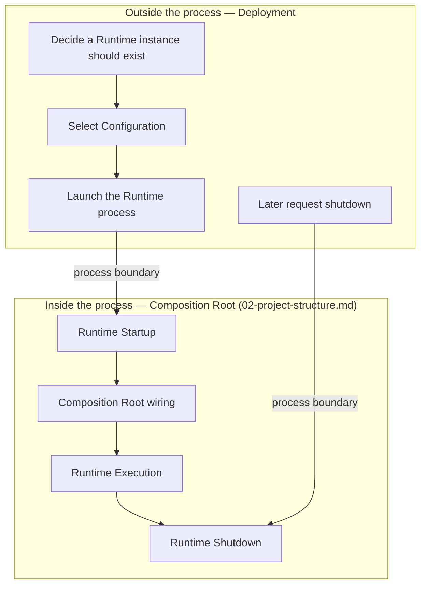
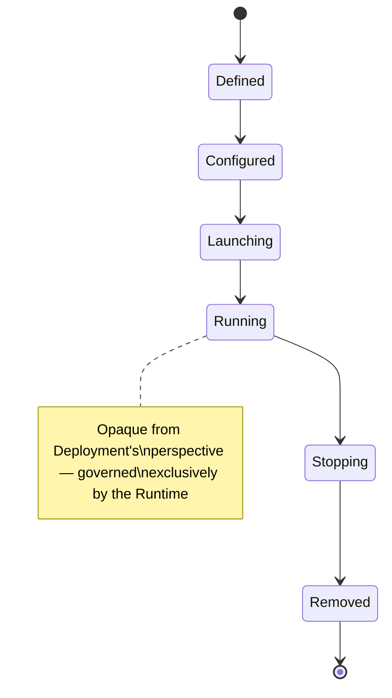

# Diagram: Deployment

Source: `29-deployment.md`.

Notes: Deployment decides that a Runtime instance exists; the Composition Root decides how it comes to life. `Running` is intentionally opaque to Deployment — everything inside it is `02-project-structure.md`'s responsibility.
