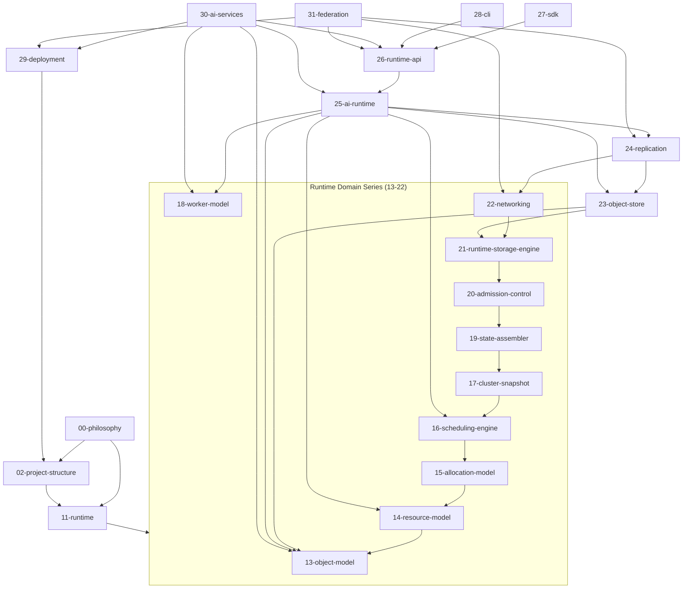

# Diagram: Document Dependency Graph

Source: derived from every document's own cross-references. Shows which documents a given document depends on (never the reverse — the corpus is acyclic, following `02-project-structure.md`'s Dependency Rule applied to documentation itself).

Notes: `27-sdk` and `28-cli` both depend only on `26-runtime-api` — never on each other, per the star-graph rule in `29-deployment.md`'s Ownership section. This graph is documentation-only; it does not imply a Cargo crate dependency graph, though the two are closely related (see `02-project-structure.md`'s own Dependency Graph).
