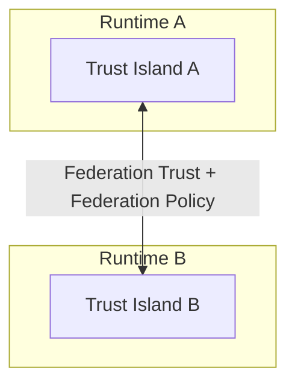
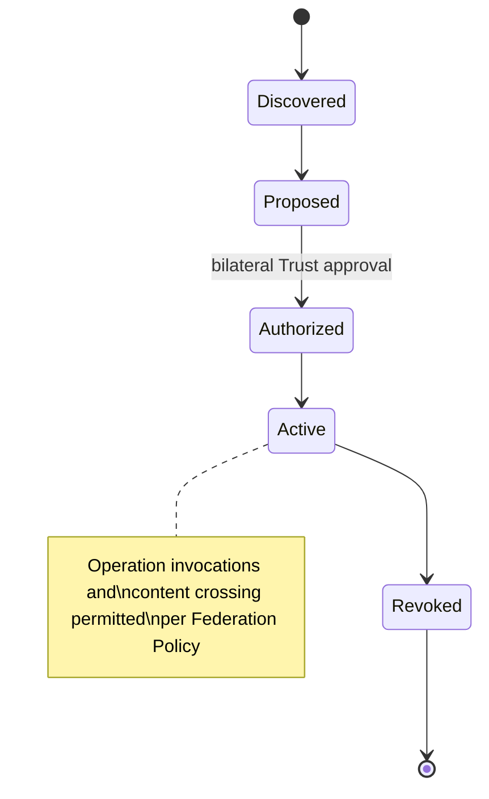

# Diagram: Federation

Source: `31-federation.md`.

Notes: Federation Trust answers "may this Runtime cooperate?" (never "may this Node join?" — that's `22-networking.md`). Federation never removes a Trust Island's boundary; it only authorizes specific interactions across it, routed through the existing Runtime API (`26-runtime-api.md`) and Replication (`24-replication.md`) — never a second protocol.
