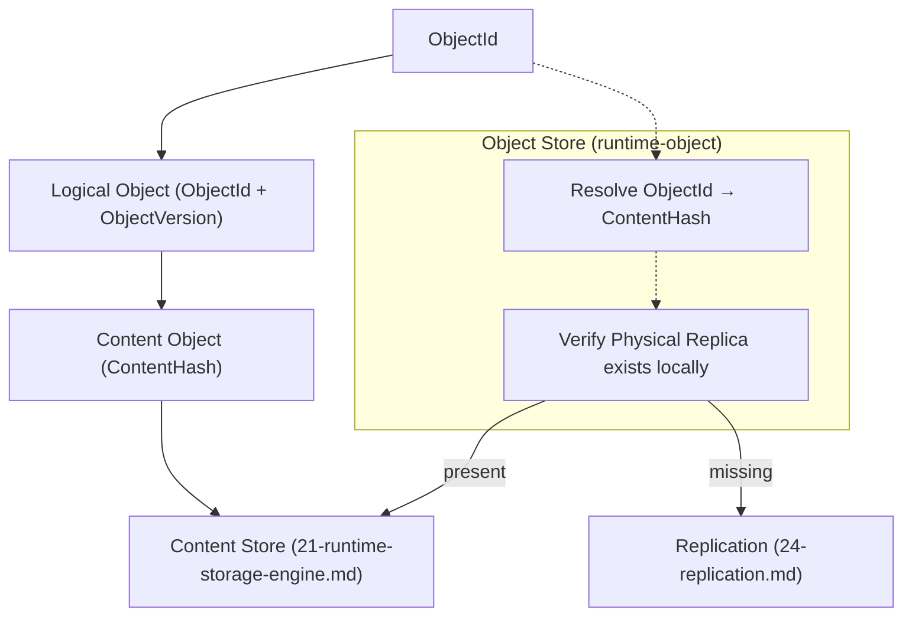

# Diagram: Object Resolution

Source: `13-object-model.md` (identity model), `23-object-store.md` (resolution service).

Notes: the Object Store is the canonical, sole entry point — no Runtime component queries `runtime-storage` directly to discover a Content Object. A missing local Physical Replica falls through to Replication's Pull mechanism, never to a second resolution path.
