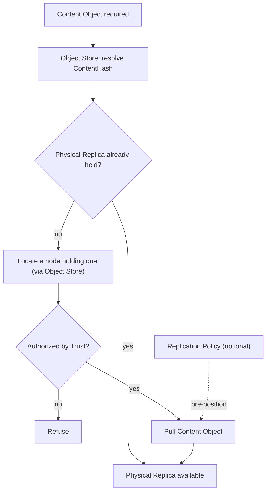

# Diagram: Replication

Source: `24-replication.md`.

Notes: Pull is the sole fundamental mechanism, sufficient alone for correctness. Push exists only as policy layered on top, never a second mechanism. Crossing a Trust Island always requires explicit Federation authorization (`31-federation.md`).
