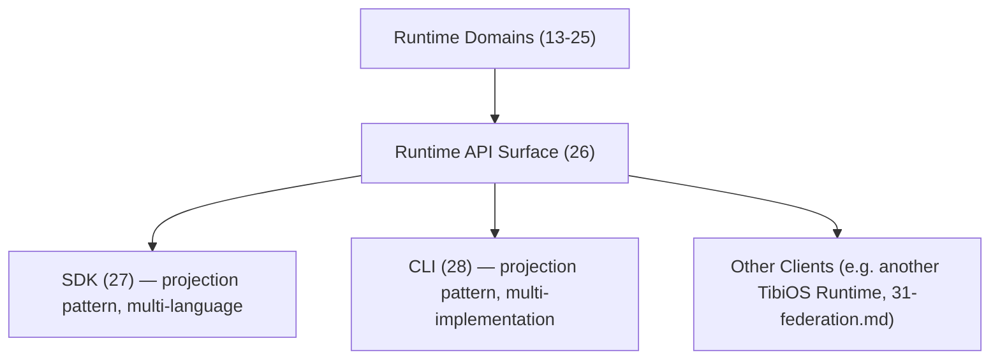

# Diagram: Runtime API / SDK / CLI

Source: `26-runtime-api.md`, `27-sdk.md`, `28-cli.md`.

Notes: a star graph, not a chain. Every consumer depends only on the Runtime API; no consumer depends on another (`Runtime API → SDK → CLI` was explicitly rejected as an unnecessarily strong dependency). Domains own meaning; `runtime-api` is the sole owner of the public surface.
