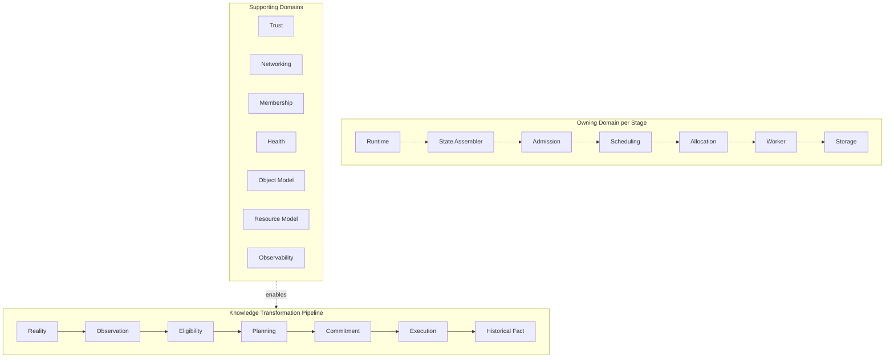

# Diagram: Runtime Overview

Source: `11-runtime.md`. Every Runtime domain, grouped by whether it participates in the knowledge-transformation pipeline or supports it.

Notes: the top row is the abstract knowledge chain (`11-runtime.md`'s Knowledge Transformer); the middle row is the owner of each stage; the bottom row lists domains that feed or constrain the pipeline without occupying a stage in it (`11-runtime.md`'s Runtime Domains table).
