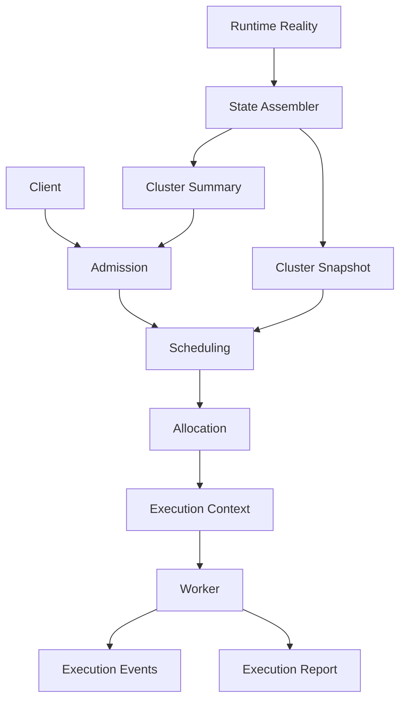
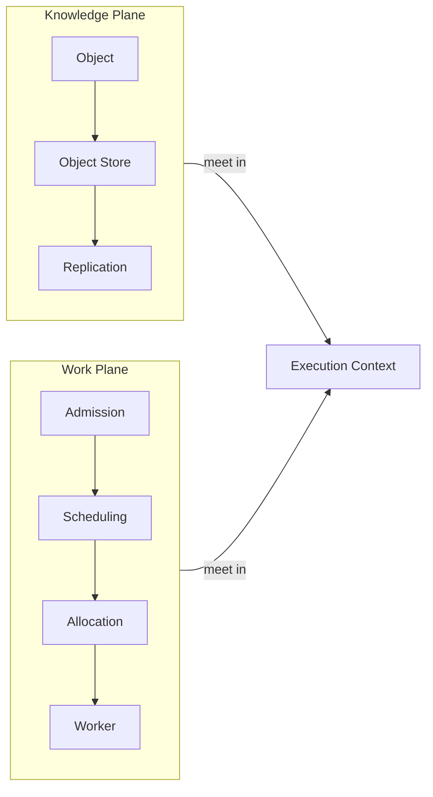

# Diagram: Runtime Pipeline & Knowledge/Work Planes

Source: `11-runtime.md` (operational pipeline), `24-replication.md` (knowledge plane / work plane).

## Operational pipeline

## Knowledge plane vs. work plane

Notes: the State Assembler is a continuous side-process, never a per-request step — Admission consults the coarse Cluster Summary, Scheduling consults the full Cluster Snapshot, both derived from the same observation. The two planes are independent and intersect exactly once, inside the Execution Context.
