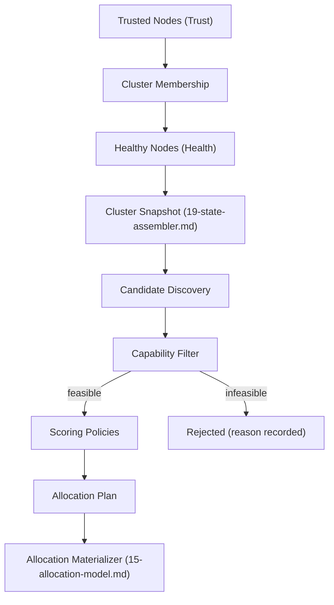

# Diagram: Scheduling Engine

Source: `16-scheduling-engine.md`.

Notes: Filter answers "can it?" (hard, boolean); Score answers "how good?" (soft, continuous) — never combined into one weighted number. Trust, Membership, and Health are each answered exactly once, upstream, never re-checked inside the Scheduling Engine.
