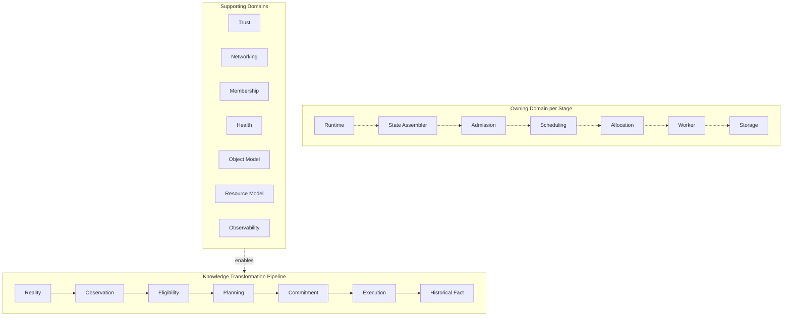

# TibiOS Core

`tibios-core` is the Rust implementation of the TibiOS Runtime — the distributed
system that turns a set of independent "Tibi Box" nodes into one logical
computer for executing intelligent (AI) workloads. This repository holds the
Runtime's architecture documentation, its Cargo workspace, and its
Spec-Driven Development (SDD) artifact trail.

## What TibiOS is

TibiOS is a distributed Runtime for orchestrating compute — with a particular
focus on AI workloads — across heterogeneous infrastructure. Applications
describe *what* should execute (a Workload); the Runtime decides *whether* it
is admitted, *where* it runs, *when* resources are committed, and *how* it is
executed and observed. The Runtime is not itself a scheduler, a storage
engine, a network stack, or an execution engine — it is the composition of
all of them, each owned by an independent domain and wired together once, at
a single Composition Root. This project (`tibios-core`) is one half of a
two-language system: the Rust Runtime here talks to Python-based AI execution
workers over a shared gRPC contract (see [The Worker gRPC
contract](#the-worker-grpc-contract) below).

## Project status

The architecture is **frozen at `architecture-v1.0`** (see
`docs/architecture/README.md` and the `architecture-v1.0` git tag). Freezing
the architecture does not mean the system is built — it means every
architectural question TibiOS answers has exactly one normative document, and
changes to those documents now require deliberately opening
Architecture v1.1 rather than casual edits.

Implementation proceeds behind that frozen model via SDD: every unit of work
is proposed, specified, designed, broken into tasks, applied, verified, and
archived, with the artifact trail kept under `openspec/`. Completed and
in-progress changes so far:

| Change | Status | What it delivered |
|---|---|---|
| `workspace-foundation` | Archived (`openspec/changes/archive/2026-08-06-workspace-foundation/`) | The 16-crate Cargo workspace skeleton, the 12 `runtime-primitives` fundamental types, and the machine-enforced dependency graph. |
| `proto-worker-contract` | Archived (`openspec/changes/archive/2026-08-06-proto-worker-contract/`) | The language-neutral `.proto` projection of the Worker Contract (`18-worker-model.md`), shared with `tibios-ray` via the monorepo's `proto/` directory. |
| `worker-grpc-adapter` | Archived (`openspec/changes/archive/2026-08-06-worker-grpc-adapter/`) | Rust codegen wiring for that contract inside `runtime-worker`: `build.rs`, a private `adapters/` module, a fallible wire↔domain conversion layer, and the containment tests that keep generated code out of the public API. |
| `worker-inbound-port` | Archived (`openspec/changes/archive/2026-08-06-worker-inbound-port/`) | The `WorkerService`/`ExecutionChannel` inbound port in `runtime-worker`, its `ExecutionEvent`/`WorkerError` data families, and retargeting `convert.rs` to the real domain types instead of local mirrors. |

The concrete capabilities this codebase actually implements and has verified
are recorded as specs of record under `openspec/specs/` — that directory,
not this README, is the source of truth for "what is built today."

**Current status, relative to `tibios-ray`:** `tibios-core` has completed its architecture (frozen at `architecture-v1.0`) and currently provides the public contracts and project skeleton — 12 of its 15 domain crates remain intentionally unimplemented stubs. `tibios-ray` is the first reference implementation of the Worker Contract, so it carries a more developed internal domain model despite covering a narrower architectural scope. Neither side has a real inference engine or an end-to-end gRPC connection wired up yet.

## Monorepo layout

`tibios-core` lives inside a monorepo alongside its Python sibling and their
shared wire contract:

```
TibiOS/                    # monorepo root (git remote: fgparamio/tibiOS, default branch: main)
├── tibios-core/           # this repository — the Rust Runtime
├── tibios-ray/            # Python sibling — Ray-based heavy AI execution
└── proto/                 # shared .proto contract, owned by neither side
```

`tibios-ray` implements one of TibiOS's Worker Contract implementations (the
heavy AI execution path, reached over gRPC); `local-infer` (in-process,
llama.cpp) is the other. The Runtime treats every Worker implementation as
interchangeable and knows nothing about which one is actually running
(`18-worker-model.md`). The `.proto` contract between the two languages lives
in its own top-level directory, owned by neither repo, because both a Rust
and a Python build need to compile against the same frozen definition without
either language's tooling or release cadence leaking into the other's.

## Core philosophy

`docs/architecture/00-philosophy.md` is the foundation every other
architecture document builds on. Its most load-bearing principles:

- **Architecture before implementation.** The architectural model is
  intentionally larger than what's implemented today — it can describe
  capabilities (overcommit, preemption, live migration...) before any code
  realizes them, and unused architectural concepts cost nothing until an
  implementation actually builds a mechanism for them.
- **Ownership.** Every mutable piece of state has exactly one authoritative
  owner; every authoritative fact belongs to exactly one consistency domain.
  Distributed-systems complexity (synchronization, races, unclear
  consistency) is treated as a symptom of unclear ownership, not an
  inherent cost of distribution.
- **Services belong to domains, not infrastructure.** Ownership doesn't stop
  at data — a domain also owns the *operations* that interpret its concepts.
  Infrastructure (storage, transport, compute) provides capability; it never
  owns meaning. A service is placed by whose language it speaks, not which
  layer happens to be nearby.
- **Facts vs. observations.** Authoritative state (things that can't be
  reconstructed by looking again — an admission decision, a lease) must be
  persisted; observational state (node health, current utilization) can
  always be re-measured and therefore never needs the same durability
  treatment. Confusing the two categories is a recurring source of
  unnecessary complexity.
- **State propagates through published facts, never through shared mutable
  state.** A domain that owns state publishes what has already become true;
  other domains observe and react on their own terms — they never mutate
  another domain's state directly and never publish facts on its behalf.

## Architecture at a glance

The architecture is documented as ~30 numbered domain documents plus the
philosophy and project-structure foundations. Each owns exactly one concern;
none redefine terms owned elsewhere (`docs/architecture/GLOSSARY.md` is the
cross-reference index, not a second definition).

| Doc | Domain / concern |
|---|---|
| `00-philosophy.md` | Architectural principles: Ownership, Authority, State (facts vs. observations), Runtime Evolution |
| `01-style.md` | Mandatory Rust coding style |
| `02-project-structure.md` | Dependency architecture: project layout, Ports & Adapters, Composition Root, shared primitives |
| `03-api-design.md` | Public API design guidelines across all crates |
| `04-error-handling.md` | Error handling: `Result`/`Option` discipline, error classification |
| `05-async-concurrency.md` | Async & concurrency guidelines (ownership and message passing over shared mutable state) |
| `06-testing.md` | Testing discipline and the testing pyramid |
| `07-performance.md` | Performance guidelines (Correctness → Safety → Simplicity → Performance, in that order) |
| `08-security.md` | Security as a design principle: assume hostile environments, secure by default |
| `09-observability.md` | Observability: metrics, logs, traces as first-class concerns |
| `10-distributed-systems.md` | Distributed-systems assumptions: the network is not reliable |
| `11-runtime.md` | The Runtime itself: how every domain composes into one logical computer |
| `12-execution-model.md` | Execution model: applications declare Workloads, the Runtime transforms them into execution |
| `13-object-model.md` | Object Model: the universal entity abstraction (Logical/Content Object, Physical Replica) |
| `14-resource-model.md` | Resource Model: the Scheduler's language for assignable capacity |
| `15-allocation-model.md` | Allocation Model: temporary assignment of Resource capacity to Workloads |
| `16-scheduling-engine.md` | Scheduling Engine: pure placement decisions via composable Policies |
| `17-cluster-snapshot.md` | Cluster Snapshot: immutable point-in-time observation used for planning |
| `18-worker-model.md` | Worker Model: the domain that executes Workloads (owns nothing but execution) |
| `19-state-assembler.md` | State Assembler: turns mutable Runtime state into immutable Cluster Snapshots |
| `20-admission-control.md` | Admission Control: authoritative eligibility decisions before scheduling begins |
| `21-runtime-storage-engine.md` | Runtime Storage Engine: infrastructure-neutral persistence for authoritative facts |
| `22-networking.md` | Networking: authenticated communication, Sessions, Trust, Membership, Health |
| `23-object-store.md` | Object Store: resolving Object identity into content |
| `24-replication.md` | Replication: guaranteeing accessible copies of Content Objects |
| `25-ai-runtime.md` | AI Runtime: AI execution as a specialization of the existing Runtime, no new primitives |
| `26-runtime-api.md` | Runtime API: the single external capability surface (Block 2 begins) |
| `27-sdk.md` | SDK: typed, per-language projection pattern of the Runtime API (no canonical crate) |
| `28-cli.md` | CLI: human-command projection pattern of the Runtime API |
| `29-deployment.md` | Deployment: whether a Runtime instance exists, with what configuration, for how long |
| `30-ai-services.md` | AI Services: composing existing Runtime concepts into standing, callable AI capabilities |
| `31-federation.md` | Federation: cooperation between two independent TibiOS Runtimes |

`docs/architecture/diagrams/` holds the official Mermaid diagrams — they are
git-versioned and authoritative; any rendered or exported form is derived,
never the source of truth. One of the simplest is reproduced here (source:
`diagrams/runtime-overview.md`), showing every Runtime domain grouped by
whether it participates in the knowledge-transformation pipeline or supports
it:



## Workspace structure

The Runtime is a 16-member Cargo workspace: 15 domain crates plus the
`runtime` binary crate, which is the Composition Root (`02-project-structure.md`).
Dependencies always point toward abstractions and the graph is enforced
mechanically (see [Architecture as executable
test](#architecture-as-executable-test) below).

### Runtime Primitives — the one shared crate

`runtime-primitives` is the *only* intentionally shared crate. It holds
infrastructure-neutral identity and value types used across every domain, and
is the one crate (besides `runtime-worker`, see below) with real logic today:

- `identity.rs` — seven ULID-backed newtypes (`ObjectId`, `NodeId`,
  `RuntimeId`, `WorkloadId`, `AllocationId`, `SessionId`, `TenantId`), each
  with a `new()` generator, fallible `parse()`, and `Display`; plus
  `ObjectVersion`, a monotonic `u64` version counter.
- `lease.rs` — `Lease`, a time-bounded authorization window with pure
  `is_expired`/`remaining` operations.
- `time.rs` — `Timestamp`, milliseconds since the Unix epoch, with a
  `now()` generator and `duration_since`.
- `content.rs` — `ContentHash`, an algorithm-qualified digest identity for
  Content Objects (hashing itself is domain logic owned elsewhere).
- `error.rs` — `ErrorClass`, the `Transient`/`Permanent`/`Fatal`
  classification every domain error maps onto.

Together these are the 12 fundamental types named in
`02-project-structure.md`. They depend only on `serde` and `ulid` — never on
async runtimes, networking, storage, or RPC frameworks — because Runtime
Primitives must remain infrastructure-neutral by design.

### Domain crates — intentional stubs

Every other domain crate (`runtime-object`, `runtime-scheduler`,
`runtime-allocation`, `runtime-admission`, `runtime-network`,
`runtime-storage`, `runtime-security`, `runtime-observability`,
`runtime-state`, `runtime-replication`, `runtime-deployment`, `runtime-api`,
`runtime-federation`) is currently a 3–7 line `lib.rs` containing only a doc
comment naming the architecture document it will implement (e.g.
`runtime-object`'s entire body is `//! Stub for the Object domain. //!
Implements 13-object-model.md and 23-object-store.md.`).

This is **zero domain logic by design**, not unfinished work: the
`workspace-foundation` SDD change deliberately scoped itself to the skeleton
— crate boundaries, dependency edges, and the shared primitives — and pushed
every domain's actual behavior and Inbound Ports to later, independently
verifiable changes. Each stub already declares, in its `Cargo.toml`, exactly
the workspace and external dependency edges its architecture document
allows; nothing more.

### `runtime-worker` — the one crate with real wire-level code

`runtime-worker` is still a stub in the domain sense (no `18-worker-model.md`
domain types like `ExecutionContext` exist yet), but the `worker-grpc-adapter`
change added a private `adapters/` module beneath it:

```
crates/runtime-worker/src/
├── lib.rs              # #![deny(private_interfaces, private_bounds)]; mod adapters;
└── adapters/            # non-pub module tree, never re-exported
    ├── mod.rs
    └── grpc/
        ├── mod.rs        # include!(generated tonic/prost code)
        └── convert.rs     # fallible TryFrom wire <-> domain conversions
```

This makes `runtime-worker` the only crate in the workspace with real
wire-level code beyond `runtime-primitives` — everything else stays a pure
stub. See [The Worker gRPC contract](#the-worker-grpc-contract) for what that
module actually does.

### `runtime` — the Composition Root

`runtime/src/main.rs` is a `fn main() {}` stub today. Per
`02-project-structure.md`, `runtime` is the sole crate allowed to depend on
every other crate, the sole place concrete implementations get wired
together, and no crate is allowed to depend on it. Dependency wiring itself
is deferred to a follow-up change.

## The Worker gRPC contract

`proto/` (at the `tibios-core` repo root) is a **manually vendored,
byte-identical copy** of the frozen `.proto` contract that actually lives one
level up, in the umbrella monorepo's `proto/` directory. `tibios-core` is a
downstream consumer of that contract, not its source of truth — vendoring
makes local builds hermetic without giving `tibios-core` ownership of the
contract. Integrity (not freshness) is checked on every clone: every vendored
`.proto` file is listed in `proto/PROTO_MANIFEST.sha256` with a SHA-256
digest, and `crates/runtime-worker/tests/proto_drift.rs` checks the vendored
copy against the umbrella source when both checkouts are present side by
side. Re-vendoring is a deliberate three-step ritual (copy, regenerate the
manifest, commit both together) documented in `proto/README.md`.

The contract itself defines two proto packages — `tibios.primitives.v1`
(identity wrapper messages) and `tibios.worker.v1` (the Worker gRPC service:
`SubmitJob`, `Cancel`, `Pulse`, and the `ExecutionEvent`/`ExecutionResponse`
oneofs) — projecting `18-worker-model.md`'s Worker Contract into a
language-neutral wire format that both this Rust codebase and the Python
`tibios-ray` project compile against.

On the Rust side, `crates/runtime-worker/build.rs` compiles the vendored
`.proto` files via `tonic-build` (client-only — `tibios-core` is the gRPC
client, `tibios-ray` is the server) into a single generated file, included
into the private `adapters::grpc` module. `adapters::grpc::convert` then
provides fallible (`TryFrom`, never `From`) conversions between the five
generated identity-wrapper messages and their `runtime-primitives`
counterparts, rejecting invalid ULID text, unset required fields, and unset
`oneof` arms — every rejection classified `ErrorClass::Permanent`
(`04-error-handling.md`). None of this transport code is reachable from
outside `runtime-worker`: it's a private module tree, and the crate denies
`private_interfaces`/`private_bounds` to keep it that way.

## How this project is built: Spec-Driven Development

Implementation work follows an SDD cycle — **propose → spec → design → tasks
→ apply → verify → archive** — rather than writing code directly against the
architecture docs. Each phase produces an artifact (a proposal, delta specs,
a design doc, a task checklist, applied code, a verification report), and
`openspec/` is the git-committed trail of that history: `openspec/specs/` is
the current source of truth for verified capabilities, `openspec/changes/`
holds in-flight change proposals, and `openspec/changes/archive/` holds
completed ones. This keeps every implementation decision traceable back to
the frozen architecture document that motivated it.

## Architecture as executable test

`runtime/tests/architecture_guard.rs` is worth calling out specifically: it
machine-enforces the architecture rather than relying on review discipline
alone. It checks, against real `cargo metadata` output:

- The workspace has exactly the expected 16 members.
- Every domain crate's workspace-internal dependencies match an explicit
  Allowed Edge Matrix (and `runtime` is the sole, deliberate exception,
  allowed to depend on all 15 domain crates while nothing may depend on it).
- Every crate's *external* (non-workspace) dependencies match an explicit
  per-crate allowlist — so a stray `tokio` or `reqwest` import anywhere fails
  the build, not just a review.
- Transport crates (`prost`, `tonic`, `tonic-build`) are allowlisted for
  exactly one crate, `runtime-worker`.
- `runtime-worker`'s generated gRPC code never leaks a transport token
  (`tonic::`, `prost::`, `OUT_DIR`, ...) outside its private `adapters/`
  module, and that module is never re-exported.

This is a concrete example of "architecture as executable test": the
Allowed Edge Matrix in this file *is* the dependency graph from
`design.md`/`02-project-structure.md`, and changing it is a deliberate,
reviewed architectural edit — never a quick fix to a red test.

## Getting started / building

```sh
cargo build --workspace
cargo test --workspace
cargo clippy --workspace -- -D warnings
```

`runtime-worker` requires the system protobuf compiler (`protoc`) at build
time, because `build.rs` invokes `tonic-build` against the vendored `.proto`
files. If `protoc` isn't found (via `PROTOC` or `PATH`), the build fails
fast with install instructions; full details, including how to point at a
non-`PATH` binary, live in `proto/README.md`.

## Where to go next

- `docs/architecture/README.md` — architecture status and the normative vs.
  reference document split.
- `docs/architecture/GLOSSARY.md` — canonical term index (points at the
  owning document for every term; defines nothing itself).
- `openspec/specs/` — the capability specs of record: what is actually
  built and verified today.

## Notes on things worth double-checking

- `tibios-ray/CLAUDE.md` still describes the shared `.proto` contract as "not
  yet created" with a "proposed location" at `../TibiOS/proto/`. That is now
  out of date: `proto-worker-contract` and `worker-grpc-adapter` have both
  landed on the `tibios-core` side, and the umbrella `proto/` directory this
  README describes does exist. Worth a follow-up update on the `tibios-ray`
  side so the two repos' docs agree.
- `worker-grpc-adapter` has committed code but has not gone through
  `sdd-verify`/`sdd-archive` yet — treat its capabilities (`worker-wire-adapter`
  in `openspec/specs/`) as implemented-but-not-yet-formally-verified until
  that happens.
