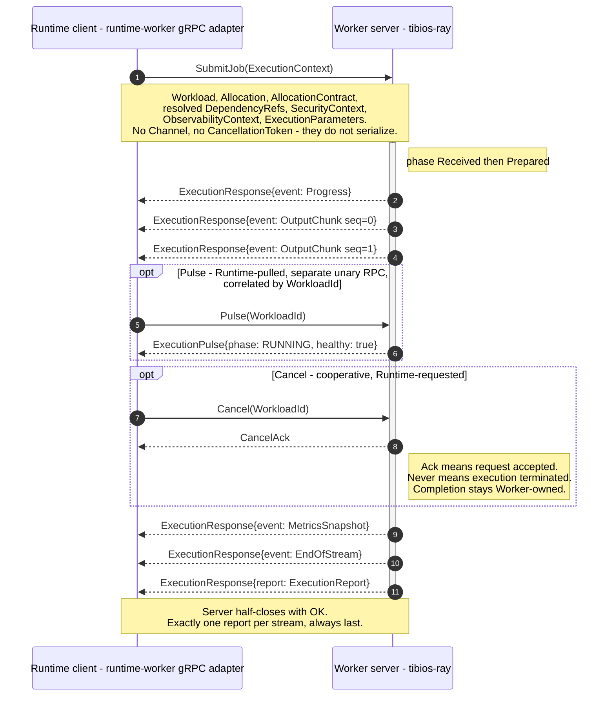

# Design: Worker Wire Contract (`.proto`)

Source of truth: `docs/architecture/18-worker-model.md` (tag `architecture-v1.0`). This document decides **how** the wire projection is shaped; it writes no `.proto` and no Rust. Its four decisions are the answers to the Open Design Questions in `proposal.md` and are inputs to `sdd-spec` and to one named follow-up change.

## Governing Principle: the Transport-Agnosticism Test

One rule resolves three of the four questions below, so it is stated once, up front.

`18-worker-model.md:88` is categorical: *"The Runtime decides how events are delivered (gRPC, WebSocket, Server-Sent Events, Kafka, persistent storage); Workers remain transport-agnostic. A Worker does not even know the concept of 'client'."* And `25-ai-runtime.md:42`: *"`local-infer` runs in-process... `tibios-ray` runs as an external process, reached over the existing gRPC contract. Neither fact is visible above the Worker abstraction."*

Two Worker implementations must satisfy the **same** contract: one in-process (`local-infer`, a `tokio::mpsc` channel, no network hop at all) and one out-of-process (`tibios-ray`, gRPC). Therefore:

> **Test** — For any piece of information crossing the boundary, ask: *would `local-infer` still need it?*
> - **Yes** → it is Worker Contract data. It MUST be a field in a proto **message**, because in-process there is no metadata, no header, and no connection to hang it on.
> - **No — it exists only because there is a network hop** → it is transport concern. It MUST live in gRPC **metadata**, TLS, or deployment configuration, and MUST NOT appear in the `.proto` messages.

This test is the tiebreaker used by D1 (credentials), D4 (correlation), and the observability nuance in D1's consequences. It is also the reason the `.proto` is a *projection* and never the canonical model (`27-sdk.md`).

## Decision Summary

| # | Question | Decision |
|---|---|---|
| D1 | Does Trust/Session (`22-networking.md`) govern this channel? | **No.** Not a Runtime Session, not a Trust Island edge. `SecurityContext` in the Execution Context is an execution-scoped authorization envelope, not peer trust. Channel credentials live in transport metadata, never in the `.proto`. |
| D2 | One `worker.proto` or a split? | **Two files, split by ownership, not by concern**: `tibios/primitives/v1/identity.proto` + `tibios/worker/v1/worker.proto`. Exactly one intra-repo import edge. |
| D3 | Rust codegen home? | **Private `adapters/` module inside `runtime-worker`.** A new crate is rejected on architectural grounds, not merely on manifest cost. Amend `runtime-worker`'s spec; leave `workspace-manifest` and the guard matrix untouched. |
| D4 | Report on the response stream or a 4th RPC? | **Confirmed, with two refinements**: `ExecutionResponse` oneof stays; the oneof is a closed set with a mandatory-set invariant, and `Cancel` returns a named `CancelAck` meaning *request accepted*, never *execution terminated*. |

---

## D1 — Trust/Session does not govern the core↔ray channel

### Decision

The Trust / Session / Membership model of `22-networking.md` **does not apply** to the Runtime↔Worker gRPC channel. Concretely:

1. The `.proto` MUST NOT contain `SessionId`, `NodeId`, `RuntimeId`, peer identity, trust status, membership, lease, or any authentication material. A Worker that could read those fields could reason about them, and `18-worker-model.md:136` forbids exactly that.
2. `ExecutionContext.security_context` is **narrow**: the already-decided authorization envelope *under which this one execution runs* — the tenant/principal on whose behalf the work is performed and the scope of what this execution is permitted to touch. It is the same category of thing `13-object-model.md:67` attaches to every Object ("Type, Owner, Metadata, **Security Context**, Lifecycle, Placement, State"), not the category `22-networking.md` attaches to a peer.
3. Authentication of the channel itself (mTLS, or Unix-domain-socket peer credentials for the co-located case) is a **deployment and transport** concern, carried in gRPC metadata / TLS, owned by the Composition Root's wiring, and invisible to the contract. It is out of scope for this change and for the `.proto`.

### Rationale

**A Worker is not a Runtime peer, by the plain scope of the document.** `22-networking.md:7`: *"The Networking domain provides communication between Runtime **instances**."* `22-networking.md:117`: *"A Runtime Session represents an authenticated communication relationship between **two Runtime instances**."* `22-networking.md:75`: Discovery answers *"Which Runtime **peers** are reachable?"* `tibios-ray` is none of these. It owns no `RuntimeId` (`02-project-structure.md:118` — `RuntimeId` is the Identity component of a Deployment Unit), it never appears in Membership (`22-networking.md:257`, `MemberJoined`/`MemberLeft`), and it never appears in a Cluster Snapshot. It is an execution engine selected *after* Scheduling has already picked a Node: `25-ai-runtime.md:42` — *"whichever Worker implementation is registered and capability-matched on the Node that Scheduling selects."* Scheduling has finished by the time this channel is used; the pipeline of `22-networking.md:397-429` ends at `Allocation → Worker`, with Networking six stages upstream.

**Applying Sessions here would invert ownership.** Sessions are owned exclusively by Networking (`22-networking.md:111`, `121`), and Streams never exist independently of a Session (`22-networking.md:163`). If the Worker channel were a Runtime Stream, then `runtime-worker` would depend on `runtime-network` — an edge that does not exist in the Allowed Edge Matrix (`architecture_guard.rs:32-34`: `runtime-worker → {runtime-primitives, runtime-allocation, runtime-object}`) and that `02-project-structure.md:280-281` rules out by name. Worse, a `SessionClosed` would then implicitly kill an in-flight execution, making Networking the de facto owner of execution termination — while `18-worker-model.md:118` says *"completion remains **owned** by the Worker... even mid-cancellation."*

**`18-worker-model.md` already draws the line explicitly.** Line 136: *"Workers execute under the Security Context supplied by the Runtime; they **never authenticate nodes, establish trust, or validate cluster membership** — that belongs to Networking/Trust."* The sentence has two halves and they are different subjects: the Worker *consumes* a Security Context (execution authorization), and the Worker *is excluded from* node authentication and membership validation (peer trust). Reading "Security Context" as "Trust Island membership" would make the same sentence simultaneously mandate and forbid the same thing. The narrow reading is the only self-consistent one.

**Federation confirms the negative.** `31-federation.md:104` lists as an anti-pattern *"treating a Networking Session as equivalent to Federation Membership"* and `31-federation.md:34` defines a Trust Island as *"the set of **Nodes** sharing one `RuntimeId` and one Trust authority."* A Worker process is not a Node joining an island; it is a capability running on a Node that is already inside one. Nothing crosses a trust boundary here, so nothing needs Federation authorization.

**The credential placement follows from the Transport-Agnosticism Test.** `local-infer` needs no bearer token to be invoked in-process — the credential exists *only* because there is a socket. So by the test, it is transport, not contract, and it stays out of the messages. `08-security.md:31` independently forbids putting session identifiers and tokens where they will be logged; proto messages are exactly what gets logged and dumped in `Debug`.

### Alternatives Considered

| Alternative | Why rejected |
|---|---|
| **Full Trust Island membership** — the Ray process authenticates as a peer, gets a `SessionId`, joins Membership | Requires `tibios-ray` to own a `RuntimeId` and appear in Cluster Snapshots, which would make it schedulable *as a Runtime*, not usable *as a Worker*. Contradicts `22-networking.md:7/117/257` and `25-ai-runtime.md:27` ("The Runtime does not distinguish between them" — `local-infer` would then need a Session too, which is absurd in-process). |
| **`SessionId` as a field on `ExecutionContext`**, even if only informational | Fails the Transport-Agnosticism Test (meaningless in-process) and hands the Worker a concept it is forbidden to reason about (`18-worker-model.md:136`). Informational fields become load-bearing fields within two releases. |
| **No Security Context at all** — treat the channel as fully trusted, drop the field | Directly contradicts the enumerated Execution Context contents in `18-worker-model.md:52`, and violates `08-security.md:111` ("Every plugin is considered untrusted until verified"). The Worker must be able to state, and the Report must be able to record, on whose authority it acted. |
| **A dedicated `Authenticate()` RPC before `SubmitJob`** | Reinvents Networking's Authentication stage in the wrong domain, and makes the Worker stateful across calls — it would have to remember an authenticated principal between Execution Contexts, which `18-worker-model.md:108` forbids ("Execution state never survives between Contexts"). |

### Consequences

- **The `.proto` gains a `SecurityContext` message with a deliberately small surface** (tenant/principal + scope of the grant, all supplied, none negotiated). `TenantId` is already a named Runtime Primitive (`02-project-structure.md:116`), so the wrapper has a home. Its precise fields are for `sdd-spec` to enumerate; this design fixes only that it is execution-scoped and supplied, never derived.
- **Ray-side gap is confirmed, not silently closed.** `tibios-ray`'s `ExecutionContext` (`execution/context.py:62-71`) has `capability`, `allocation_contract`, `dependencies`, `channel`, `cancellation` — no Security Context, no Observability Context, no Execution Parameters, no Workload/Allocation identity. The mapping table must record these as **ray-side follow-ups**, with the `.proto` carrying the doc's full set (proposal Approach §1).
- **Observability Context has a subtle split, resolved by the same test.** `09-observability.md:47` mandates that the correlation ID cross the core↔ray gRPC boundary *"via metadata, W3C traceparent style."* But `ExecutionReport.trace_id` (`execution/report.py:39`) is contract data — `local-infer` must produce it too. Resolution: **the message field is normative, the metadata copy is derived.** `ExecutionContext.observability_context` carries the trace identifiers as message fields (that is what the Worker echoes into its Report); the gRPC client interceptor *additionally* emits the standard `traceparent` header derived from that field, purely so off-the-shelf OTel instrumentation on both sides links spans automatically. If the two ever disagree, the message wins, and the adapter is the one place that can enforce it. A Worker MUST NOT read transport metadata to obtain contract data.
- **A negative spec requirement is now available and should be written**: the `.proto` MUST NOT declare `SessionId`, `NodeId`, `RuntimeId`, membership, trust status, lease, or credential fields — testable by grep in the verify phase, and the cheapest possible guard against this decision being quietly reversed.
- **Deferred, explicitly**: choosing mTLS vs. UDS peer credentials for the channel. It changes no message and no RPC, so it cannot block this change; it belongs to the deployment/wiring change that stands up the adapter (`29-deployment.md` territory).

---

## D2 — Two files, split by ownership: `identity.proto` + `worker.proto`

### Decision

```
../TibiOS/proto/
└── tibios/
    ├── primitives/v1/identity.proto   package tibios.primitives.v1
    └── worker/v1/worker.proto         package tibios.worker.v1   (imports identity.proto)
```

- `identity.proto` — `ObjectId`, `ObjectVersion`, `ContentHash`, `WorkloadId`, `AllocationId`. Nothing else. No service. (`AllocationId` added in a post-verify fix batch as its own distinct Runtime Primitive, never `ObjectId` — see `worker-wire-contract/spec.md` "AllocationId Is a Distinct Primitive, Never ObjectId"; this line was stale, still naming only the original four messages, until this pass.)
- `worker.proto` — the `WorkerExecution` service, `ResolvedModelRef`, `AllocationContract`, `SecurityContext`, `ObservabilityContext`, `ExecutionContext`, `ExecutionResponse`, `ExecutionEvent` (+ its 6 arms), `ExecutionReport`, `ExecutionPulse`, `ExecutionPhase`.
- Exactly **one** intra-repo import edge, plus well-known-type imports (`google/protobuf/duration.proto` for `AllocationContract.max_execution_duration` and `ExecutionReport.duration`).
- Versioned directory + package (`.../v1/`, `tibios.*.v1`) from day one, so contract evolution is a new package rather than a breaking edit (`26-runtime-api.md:92` — *"versioning it"* instead of breaking an existing contract).

Rejected: a single `worker.proto`. Rejected: the four-way split by concern (`identity`/`context`/`events`/`report`).

### Rationale

**The split follows the ownership boundary that already exists in the workspace, and nothing else.** `02-project-structure.md:325`: *"Data contracts belong to the domain that **produces** them."* The identity wrappers are produced by `runtime-primitives` — `ObjectId`, `WorkloadId`, `ContentHash`, `ObjectVersion` are all in the enumerated primitive list (`02-project-structure.md:116`), and every domain depends on them (`02-project-structure.md:167-174`). The Worker messages are produced by the Worker/Runtime pair. Two owners, two files. This is the same reasoning that gives `runtime-primitives` its own crate rather than duplicating `ObjectId` in each domain.

**The four-way split fails on the same rule that the two-way split passes.** `02-project-structure.md:351`: *"Large domains may contain internal modules — they are never split by technology."* `identity`/`context`/`events`/`report` are four slices of **one** owner's language (`18-worker-model.md`). Splitting them creates four files, four import edges, four Python `*_pb2` modules, and four opportunities for a circular import (`context.proto` needs `ids`, `report.proto` needs `ids`, `events.proto` is referenced by the response envelope which lives with the service...) — all to express a boundary that does not exist in the architecture.

**A single file fails the ownership rule in the other direction.** It would nail the primitive identity wrappers to the Worker contract. The next consumer — the Runtime API projection (`26-runtime-api.md`) or the SDK (`27-sdk.md`, *"typed projection pattern, multi-language, no canonical crate"*) — would either import `tibios.worker.v1` just to get an `ObjectId` (a dependency on the Worker domain that `02-project-structure.md:280` would never permit between crates) or redeclare the wrappers (exactly the copy-paste drift this whole change exists to end, per proposal Intent).

**Python codegen fragility is real but bounded at one edge.** `grpc_tools.protoc` emits `from tibios.primitives.v1 import identity_pb2` — an *absolute* import rooted at the `-I` path, which breaks when the generated tree is not importable from the package root. With one import edge this is a single, documented `-I ../TibiOS/proto --python_out=src` invocation and a `tibios/` package that must expose `__init__.py` files. With four edges it becomes a recurring tax. `prost`/`tonic` pays no such cost either way (one `include_proto!` per package), so Python's constraint is the deciding one — and it argues for *few* files, not *one*.

### Alternatives Considered

| Alternative | Why rejected |
|---|---|
| **Single `worker.proto`** | Locks Runtime Primitives inside the Worker domain's file; forces the next projection to duplicate or misdepend. Cohesion gain is illusory — the file is ~250 lines either way. |
| **Four-way split by concern** | Splits one owner's language by technology-shaped slices, forbidden by `02-project-structure.md:351`; multiplies the Python import hazard by four. |
| **Unversioned packages (`tibios.worker`)** | Guarantees that the first breaking change is a breaking change. Versioned packages cost one directory today. |
| **`buf` module with a `buf.yaml` split per directory** | Reasonable tooling, but tooling choice is not an architectural boundary; a `buf.yaml` can be added later over either layout without moving a message. Deferred to the codegen follow-up. |

### Consequences

- The proto root `../TibiOS/proto/` is a **sibling of both repos**, owned by neither (proposal Scope). This is a real build hazard for Rust: a `build.rs` reading a path outside the workspace root is not reproducible in a single-repo CI clone. Recorded as a risk below; the mechanism (git submodule vs. vendored copy with a hash check vs. a `buf` remote module) is a decision for the D3 follow-up, not for this change, because it changes no message.
- `identity.proto` is deliberately service-free, so future projections can depend on it without inheriting an RPC surface.
- Both codegens get a stable, boring import graph: `worker.proto → identity.proto → (nothing)`, plus WKT.

---

## D3 — Codegen lives in a private `adapters/` module inside `runtime-worker`

### Decision

Generated `prost`/`tonic` code lives in **`runtime-worker/src/adapters/`**, in a **private** module, alongside a hand-written mapping layer. No new crate. The workspace stays at exactly 16 members and the Allowed Edge Matrix is unchanged.

```
runtime-worker/
├── build.rs                     tonic-build; the only place protoc runs
└── src/
    ├── lib.rs                   crate doc citing 18-worker-model.md; re-exports nothing from adapters
    ├── ports/                   Worker domain language (Rust types, no prost)
    └── adapters/
        ├── mod.rs               private: `mod grpc;`
        └── grpc/
            ├── mod.rs           `tonic::include_proto!("tibios.worker.v1");` — private
            └── convert.rs       TryFrom<proto::X> for domain::X, and back
```

The public surface of `runtime-worker` MUST contain no `prost`/`tonic` type, and MUST NOT re-export the generated module.

### Rationale

**The new-crate option is not merely expensive — it fails the architecture's own admission test.** `02-project-structure.md:437-446` (Architecture Review Checklist, *"before creating a new crate, verify"*): does it own a new architectural responsibility? No — generated code re-expresses an existing domain's language in wire form. Does it expose a unique public language? No — it is `18-worker-model.md`'s language, verbatim. Does it justify becoming a first-class Runtime domain? No. And `02-project-structure.md:359` closes it: *"Avoid creating crates for utilities, helpers, abstractions, or convenience APIs. Crates represent domains, never implementation details."* Generated protobuf code is the definition of an implementation detail. So the manifest constraint is not what rules the crate out; the crate is simply not a domain.

**`runtime-worker` is where the architecture already says this belongs.** `25-ai-runtime.md:19`: *"AI Worker implementations (`local-infer`, `tibios-ray`) belong to `runtime-worker`."* And the encapsulation precedent is explicit for the closest analogue: `22-networking.md:329` — *"Networking never exposes transport-specific APIs to other Runtime domains. Implementation technologies remain encapsulated inside Networking."* Substitute Worker for Networking and the sentence is this decision. `02-project-structure.md:355` grants the mechanism: *"A Runtime crate may internally organize code into `api/`, `domain/`, `ports/`, `adapters/`... This internal organization is invisible to other crates."*

**The blocking constraint is narrower than it looks.** `runtime-worker`'s spec forbids *public* traits ("Stub Crate, No Public Traits"). `tonic` generates a public `WorkerExecution` service trait and a public client — but only inside the module where `include_proto!` is expanded. Keeping that module private makes the generated trait `pub` *within a private module*, i.e. invisible outside the crate. The **spirit** of the requirement (nothing leaks into the public surface before the domain is designed) is preserved exactly; only its **letter** ("no public trait declarations", scenario at `runtime-worker/spec.md:28`) needs amending — and it needs amending anyway the moment the Worker domain grows its real Inbound Port.

**Cost comparison, since the question asked which is easier to amend.** Amending `runtime-worker`'s spec touches **one requirement in one spec, zero guard code**. Adding a crate touches, at minimum: `workspace-manifest/spec.md` Requirement "Virtual Workspace With Exact Members" (16→17, plus the enumerated name list); `EXPECTED_MEMBERS` in `architecture_guard.rs:80-97`; a new `ALLOWED` entry (`architecture_guard.rs:16-74`); `runtime/Cargo.toml`, because `runtime_depends_on_all_domain_crates_without_violation` (`architecture_guard.rs:240-243`) asserts **equality** between `runtime`'s deps and every non-`runtime` member — so a new member *forces* the Composition Root to depend on generated code; and `runtime-composition-root/spec.md:13,17` ("all 15 domain crates"). Five files, two specs, one forced architectural edge — to host something that is not a domain. The comparison is not close.

### Alternatives Considered

| Alternative | Why rejected |
|---|---|
| **New `runtime-worker-proto` (or `tibios-proto`) crate** | Fails `02-project-structure.md:437-446` and `:359`; forces the Composition Root to depend on generated code via the guard's equality assertion; amends 2 specs + 3 code sites. |
| **Generate into `runtime-primitives`** (so identity wrappers map for free) | Explicitly forbidden: `02-project-structure.md:155` names `prost` and `tonic` as *protocols* that commit a type to a wire format, versus `serde` as a structural contract — and `PRIMITIVES_EXTERNAL` (`architecture_guard.rs:77`) machine-enforces the allowlist `{serde, ulid}`. This is the one option the guard already rejects on its own. |
| **Generate into `runtime` (Composition Root)** | `02-project-structure.md:470`: *"The Composition Root owns no business behavior. Its responsibility is assembly only."* An adapter is not assembly. It would also make every domain's wire contract land in one crate over time. |
| **Generate into `runtime-network`** | D1 already established this is not a Runtime Session; routing it through Networking would create the `runtime-worker → runtime-network` edge the matrix forbids and re-open the ownership inversion D1 rejected. |
| **Skip codegen; hand-write the wire types** | Reintroduces exactly the drift the `.proto` exists to eliminate, and doubles the maintenance for zero architectural gain. |

### Consequences and the exact follow-up contract

This change implements none of the below. It specifies it, so the follow-up is mechanical.

**Follow-up change name (proposed): `worker-grpc-adapter`.**

*Spec deltas required:*

1. `openspec/specs/runtime-worker/spec.md` — **MODIFIED** Requirement "Stub Crate, No Public Traits" → "Generated Transport Code Stays Private". New shape:
   - `src/lib.rs` keeps the crate-level doc comment citing `18-worker-model.md` (unchanged scenario).
   - Generated `prost`/`tonic` code MUST reside in a non-`pub` module under `src/adapters/` and MUST NOT be re-exported.
   - No `prost`/`tonic` type may appear in `runtime-worker`'s public API.
   - New scenarios: *"Generated module is not public"* (the `adapters` module declaration carries no `pub`); *"Public API is free of transport types"* (`cargo public-api` / `cargo doc` surface contains no `tonic::`/`prost::` path); *"Crate still compiles"* (`cargo check -p runtime-worker`).
2. `openspec/specs/runtime-worker/spec.md` — **MODIFIED** Requirement "Exhaustive Dependency Set": workspace deps stay exactly `{runtime-primitives, runtime-allocation, runtime-object}` (unchanged), extended with an explicit *external* allowlist `{tonic, prost}` + build-dep `{tonic-build}`, so the addition is reviewed rather than incidental.
3. `openspec/specs/workspace-manifest/spec.md` — **UNCHANGED**. Explicitly asserted, so the follow-up's verify phase confirms the 16-member pin survived.
4. New capability spec for the adapter's behavior (conversion is fallible, see below) — name it in the follow-up, not here.

*Guard-test updates required (`runtime/tests/architecture_guard.rs`):*

1. `ALLOWED` matrix — **no change** (no new workspace edges).
2. `EXPECTED_MEMBERS` — **no change** (still 16).
3. `PRIMITIVES_EXTERNAL` — **no change**; it now also does double duty as the machine guard that `prost`/`tonic` never reach `runtime-primitives` (`02-project-structure.md:155`).
4. **New**: generalize the single `PRIMITIVES_EXTERNAL` allowlist into a per-crate external allowlist so `{tonic, prost, tonic-build}` is asserted to appear on `runtime-worker` **and nowhere else**. This is the test that keeps the protocol dependency from spreading; without it, D3's containment is a convention rather than a guarantee.
5. **New**: a public-surface assertion for `runtime-worker` (no transport type in the public API).

*Unresolved input the follow-up must decide first:* how `../TibiOS/proto/` becomes available to `build.rs` reproducibly (submodule / vendored copy with hash check / `buf` remote module). A `build.rs` reaching outside the workspace root is not reproducible in a single-repo CI clone.

*Non-obvious consequence to carry forward:* because `prost`/`tonic` may never enter `runtime-primitives`, the generated `tibios.primitives.v1.ObjectId` message is **not** `runtime_primitives::ObjectId`. A hand-written conversion layer (`adapters/grpc/convert.rs`) is mandatory. It must be **`TryFrom`, not `From`** — it is the enforcement point for proto3 optionality, ULID parsing, and unset-oneof rejection, per `08-security.md:63` (*"Never deserialize untrusted data blindly. Validate versions, sizes, and limits"*) and `04-error-handling.md` / `ErrorClass`. This is a feature of the decision, not a cost: it puts one auditable boundary between the wire and the domain.

---

## D4 — `ExecutionResponse` oneof confirmed, with two refinements

### Decision

The proposal's envelope is **confirmed**:

```
ExecutionResponse { oneof payload { ExecutionEvent event = 1; ExecutionReport report = 2; } }
SubmitJob(ExecutionContext) returns (stream ExecutionResponse)
```

Two refinements are added:

- **R1 — Stream invariant.** Exactly one `report` per stream, and it is always the **last** message. The canonical terminal sequence is `... ExecutionEvent(EndOfStream)`, then `ExecutionResponse{report}`, then the server half-closes with `OK`. `EndOfStream` and the Report are **not** collapsed: `EndOfStream` is one of the six documented `ExecutionEvent` arms (`18-worker-model.md:94`) marking the end of *application output*; the Report terminates the *execution* (`18-worker-model.md:102`, *"Execution produces events. Completion produces a report."*). In-process, `local-infer` has an `EndOfStream` and no stream to close — collapsing them would make the contract transport-dependent, failing the governing test.
- **R2 — Closed set, mandatory-set.** The oneof has exactly two arms, permanently. An unset `payload` (which proto3 produces when a newer peer sends a third arm an older peer does not know) is a **protocol error** the receiver MUST reject via `TryFrom`, never silently skip. `ExecutionPulse` never becomes a third arm — it has its own RPC, because it is Runtime-pulled, not Worker-pushed.
- **R3 — `Cancel` returns a named `CancelAck`, not `google.protobuf.Empty`.** The ack means *"cancellation request accepted"*, never *"execution terminated"*. Termination is observed only on the response stream, as final events + `EndOfStream` + Report. A named empty message stays evolvable; `Empty` does not.

`ExecutionResponse` carries **no** `WorkloadId`. The stream itself is the correlation: one `SubmitJob` → one stream → one execution.

### Rationale

**A fourth `GetReport(WorkloadId)` RPC would make the Worker stateful between executions.** After the stream closes, the Worker would have to retain the Report until someone fetched it — per-execution state surviving the Execution Context, which `18-worker-model.md:108` forbids: *"Execution state never survives between Contexts."* Only Worker-owned *caches* (a loaded model) may survive (`:108`, `:110`); a pending Report is business state, not a cache. It would also need eviction policy, a retention window, and a "report not yet ready" error — a small store the Worker would own, in a component whose motto is *"Own nothing except execution"* (`18-worker-model.md:155`).

**Cancellation settles it decisively.** `18-worker-model.md:118`: *"Workers acknowledge, perform cleanup, terminate execution, **emit final events, and generate an Execution Report**... completion remains owned by the Worker."* A cancelled execution must still deliver a Report. On one stream this is trivially expressible and trivially ordered. With a fourth RPC, the Runtime that just cancelled must then poll a Worker that may already be tearing down — inventing a race the single-stream shape does not have.

**Ordering is free and total.** gRPC server streaming preserves order on a single stream, so R1's invariant needs no sequence number, no timestamp, and no reassembly. Two independent transports (a stream plus a unary fetch) would have no such guarantee, so the Runtime would need its own join logic to know whether the events it holds are complete.

**A seventh `ExecutionEvent` arm is off the table for a stated reason, not by fiat.** `18-worker-model.md:94` enumerates exactly six arms, and both sides currently `match` exhaustively on them (Rust `match`, and pyright over the PEP 695 tagged union at `execution/events.py:68-70`). Adding `Report` there would also be a category error: `18-worker-model.md:100` — Reports *"never transport application output... Application data travels through the Execution Channel; operational data belongs to the Execution Report."* Two categories, one wire, two oneof arms is the exact shape of that sentence.

**`WorkloadId` on each response would be duplicated state.** It is already the sole correlation key on `Cancel` and `Pulse` (settled in the proposal), and the `ExecutionContext` that opened the stream carries it. Repeating it per message creates a field that can disagree with the stream it arrived on, and nothing consumes it.

### Alternatives Considered

| Alternative | Why rejected |
|---|---|
| **Fourth RPC `GetReport(WorkloadId)`** | Makes the Worker hold post-execution state (`18-worker-model.md:108`); races with cancellation teardown (`:118`); needs retention policy and a not-ready error; splits ordering across two transports. |
| **7th `ExecutionEvent` arm `ReportProduced`** | Breaks the documented six-arm set (`18-worker-model.md:94`) and the proposal's success criterion; conflates application output with operational summary (`:100`). |
| **Report in gRPC trailers** | Fails the Transport-Agnosticism Test outright — trailers do not exist in-process. Also size-bounded and effectively unstructured. |
| **Collapse `EndOfStream` into the Report** | Makes the six-arm event set transport-dependent and deletes the only in-process end-of-output marker `local-infer` has. |
| **`ExecutionPulse` as a third oneof arm (Worker-pushed)** | Inverts who asks: Pulse is Runtime-pulled health of one execution (`18-worker-model.md:114`). Pushing it would also make the Worker decide observation cadence, which is Runtime policy. |
| **`Cancel` returns `google.protobuf.Empty`** | Not evolvable; and an unnamed empty is routinely misread as "done", which is exactly the wrong meaning here. |

### Consequences

- Both sides keep an exhaustive two-way `match`: Rust matches `ExecutionResponse::payload`, Python matches the existing tagged union plus one report branch. No exhaustiveness is lost on either side.
- R1 and R2 are directly testable and belong in `sdd-spec` as scenarios: *report is last and unique*, *unset oneof is rejected*, *cancelled execution still yields a Report on the same stream*.
- A Worker that dies mid-execution produces a stream error with **no** Report. That is correct and must be stated: the absence of a Report is the Runtime's signal, and recovery is Runtime policy the Worker never knows (`18-worker-model.md:122`). Nothing in the contract needs to model it.
- `Pulse` and `Cancel` for an unknown `WorkloadId` return `NOT_FOUND`. Neither is a Worker decision about recovery; both are plain "I am not running that."

---

## Sequence: `SubmitJob` lifecycle

Source: `18-worker-model.md` (Execution Context, Execution Events, Execution Report, Execution Pulse, Cancellation); D4 above.



Notes: the two `opt` blocks are independent of each other and of stream progress — `Pulse` may be called any number of times or never, `Cancel` at most once. Neither interrupts the response stream: after a `CancelAck` the Worker still emits its final events, `EndOfStream`, and the Report on the *same* stream, because `18-worker-model.md:118` keeps completion Worker-owned even mid-cancellation. The Execution Channel and the `CancellationToken` of the in-process contract have no wire representation: on the wire the Channel **is** the response stream and cancellation **is** the `Cancel` RPC (proposal Approach §2). Nothing in this diagram establishes a Session, authenticates a peer, or consults Trust — see D1.

---

## Invariants This Design Imposes on the `.proto`

These are the testable consequences `sdd-spec` should turn into requirements:

1. No `SessionId`, `NodeId`, `RuntimeId`, membership, trust status, lease, or credential field anywhere. (D1)
2. `SecurityContext` and `ObservabilityContext` are supplied, execution-scoped, and immutable; the Worker never negotiates or derives them. (D1, `18-worker-model.md:52`)
3. Contract data lives in messages, never in gRPC metadata; the `traceparent` header is derived from the message, never authoritative. (Governing Principle, `09-observability.md:47`)
4. Exactly two proto files, one intra-repo import edge, versioned packages. (D2)
5. `ExecutionEvent` has exactly six arms; `ExecutionResponse` has exactly two. (D4, `18-worker-model.md:94`)
6. Exactly one `ExecutionReport` per stream, always last, present even for cancelled executions. (D4)
7. `Cancel` returns a named ack message meaning *accepted*. (D4)
8. Every message carries a comment citing its `18-worker-model.md` section. (proposal Success Criteria)
9. Nothing encodes retry, attempt number, or recovery strategy. (`18-worker-model.md:122`)

## Risks and Assumptions Requiring Validation

| Risk / assumption | Impact | Handling |
|---|---|---|
| `../TibiOS/proto/` lives outside both repos; a Rust `build.rs` reading it is not reproducible in a single-repo CI clone | Blocks the D3 follow-up, not this change | Named as the first decision of `worker-grpc-adapter`: submodule vs. vendored copy + hash check vs. `buf` remote module |
| `SecurityContext` field set is decided by `sdd-spec` with no dedicated Trust/Security architecture doc to project from (`08-security.md` is guidelines, not a domain model) | Under- or over-modeling on first cut | Keep it minimal and supplied-only (tenant/principal + grant scope); anything beyond that needs a `runtime-security` architecture decision first, not a proto field |
| `tibios-ray`'s `ExecutionContext` lacks Security/Observability Context, Workload, and Allocation identity | Mapping table cannot be lossless in the ray→proto direction on day one | Record as ray-side follow-ups in the normative mapping table (proposal Risks); the `.proto` carries the doc's full set regardless |
| Amending `runtime-worker`'s "no public traits" requirement is the first loosening of a frozen spec | Precedent risk | The amendment is narrow and paired with two *new* machine guards (private-module + per-crate external allowlist), so the crate's public surface ends up more constrained than before, not less |
| D1's "not a Runtime peer" reading could be revisited if a Worker ever runs on a node outside the Trust Island | Would reopen D1 | Out of scope today (`25-ai-runtime.md:42`: the Worker is on the Node Scheduling selected). If it ever changes, the answer is Federation authorization (`31-federation.md`), still not a Worker-visible field |
| proto3 field presence vs. Python `X \| None` | Silent semantic loss | `optional` on every nullable field + `TryFrom` validation in the Rust adapter (D3); spec scenarios per proposal Risks |

## Inputs to Downstream Phases

- **`sdd-spec`** — the nine invariants above become requirements with scenarios; the `SecurityContext`/`ObservabilityContext` field sets are the only genuinely new modeling work left.
- **`sdd-tasks`** — two files, one import edge, `protoc`/`buf` lint gate, and the normative mapping table.
- **Follow-up change `worker-grpc-adapter`** — the exact spec deltas and guard-test updates are enumerated in D3; nothing there is left to rediscover.
- **`tibios-ray` follow-up** — the Execution Context gaps listed in D1's Consequences.
