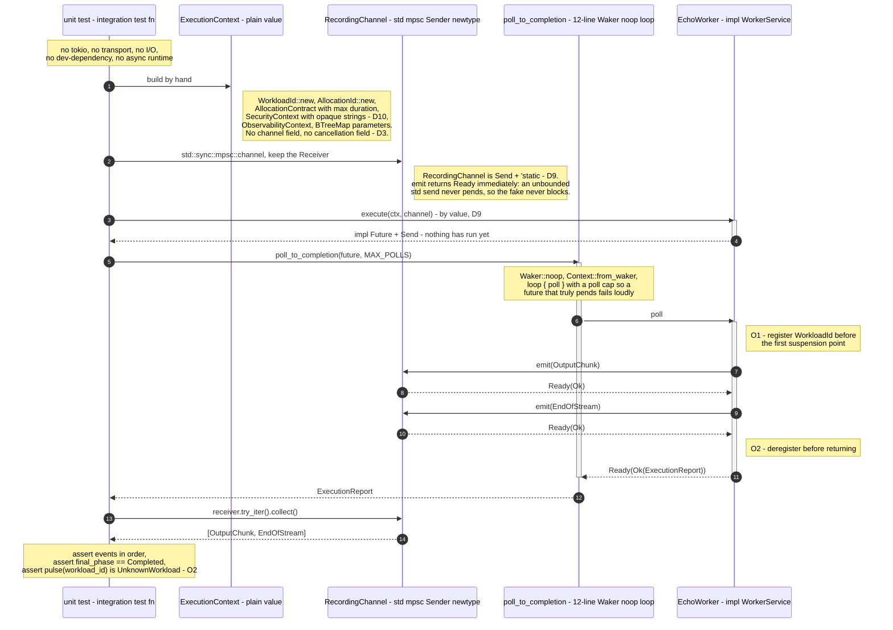

# Design: Worker Inbound Port (the Worker domain's public language)

This change's proposal settled four questions and deferred four more by name (`proposal.md:79`): the async mechanism and dyn-compatibility (proposal decision #4), `SecurityContext.tenant_id`'s type, how `cancel`/`pulse` correlate a `WorkloadId` given that Workers are reusable, and the slice count. This document settles those four. Decisions are numbered **D9–D12**, continuing `openspec/changes/archive/2026-08-06-proto-worker-contract/design.md` (D1–D4) and `openspec/changes/archive/2026-08-06-worker-grpc-adapter/design.md` (D5–D8), so all three read side by side without collision.

Nothing here reopens D1–D8. The `.proto` is frozen (`openspec/specs/worker-wire-contract/spec.md`), generated code stays inside the private adapter module (D3, D7), and the workspace stays at 16 members.

## Decision Summary

| # | Question | Decision |
|---|---|---|
| D9 | Async mechanism and dyn-compatibility for `WorkerService` / `ExecutionChannel` | **Native RPITIT with an explicit `+ Send` bound on the returned future — not bare `async fn`, not `async_trait`, not `Pin<Box<dyn Future>>`.** `execute` is generic over the channel (`C: ExecutionChannel`, taken by value), which makes `WorkerService` permanently `dyn`-incompatible — accepted, because **every dynamic-dispatch escape hatch is implementable by the consumer without touching the port** (Composition-Root-owned enum, or a Composition-Root-owned boxing wrapper). `EXTERNAL_ALLOWED` unchanged. |
| D10 | `SecurityContext.tenant_id`: `runtime_primitives::TenantId` or `String`? | **`String` — all three fields stay opaque, carried and never interpreted.** A Worker that rejects an execution because a tenant string is malformed has made an authorization-shaped decision, which belongs to Admission (`20-admission-control.md:47`), not to a domain forbidden from validating identity (`18-worker-model.md:136`). The frozen wire already made this choice positively: `identity.proto` declares exactly five wrappers and "Nothing else", and `TenantId` is not among them. |
| D11 | How do `cancel(WorkloadId)` / `pulse(WorkloadId)` locate an in-flight execution inside a reusable Worker? | **The Worker implementation's own private bookkeeping. The port signature does not change.** The wire already imposed this obligation on `tibios-ray` (`worker.proto:198-204` — correlated solely by `WorkloadId`, "No compound ID or issuance-count field is ever encoded here"); imposing anything else on `local-infer` would make the two satisfy different contracts. The port adds three testable *obligations* — register before the first suspension point, deregister before `execute` returns, reject unknown/duplicate — and mandates **no mechanism**. |
| D12 | Slice count and order | **Seven slices, not five**, in four waves. S1 ∥ S2 → S3a ∥ S3b → S4 ∥ S5a → S5b. ~1600 changed lines total; chained PRs are mandatory, not optional. |

---

## D9 — Native RPITIT with an explicit `Send` bound; static dispatch; no new dependency

### Decision

Both ports are declared with **return-position `impl Trait` in trait position (RPITIT)** carrying an explicit `+ Send` bound, not with bare `async fn`:

```rust
// crates/runtime-worker/src/ports/execution_channel.rs (shape, not final code)

/// Outbound Port (`02-project-structure.md:198`), owned by the Worker
/// domain: the Runtime supplies an implementation, the Worker writes to it,
/// and the Worker never learns what is on the other side.
pub trait ExecutionChannel: Send + 'static {
    fn emit(
        &self,
        event: ExecutionEvent,
    ) -> impl core::future::Future<Output = Result<(), ChannelClosed>> + Send;
}
```

```rust
// crates/runtime-worker/src/ports/worker_service.rs (shape, not final code)

/// Inbound Port (`02-project-structure.md:196`, which names it).
pub trait WorkerService: Send + Sync {
    fn execute<C>(
        &self,
        context: ExecutionContext,
        channel: C,
    ) -> impl core::future::Future<Output = Result<ExecutionReport, WorkerError>> + Send
    where
        C: ExecutionChannel;

    fn cancel(
        &self,
        workload_id: WorkloadId,
    ) -> impl core::future::Future<Output = Result<CancelAck, WorkerError>> + Send;

    fn pulse(
        &self,
        workload_id: WorkloadId,
    ) -> impl core::future::Future<Output = Result<ExecutionPulse, WorkerError>> + Send;
}
```

Four sub-decisions, each load-bearing:

1. **RPITIT with `+ Send`, not `async fn`.** Implementers may still write `async fn execute(...)` in their `impl` block — an `async fn` in an impl satisfies an RPITIT `-> impl Future` method, and the compiler then *checks* the `Send` bound rather than silently omitting it.
2. **`execute` is generic over the channel, and takes it by value.** Not `&dyn ExecutionChannel`, not `&C`.
3. **`ExecutionChannel: Send + 'static`** as supertrait bounds; **`WorkerService: Send + Sync`**, deliberately without `'static`.
4. **`WorkerService` is `dyn`-incompatible, permanently**, and that is stated in its doc comment rather than discovered by the first person who tries.

`runtime-worker`'s external allowlist stays exactly `{prost, tonic, tonic-build}` (`architecture_guard.rs:96`); no `EXTERNAL_ALLOWED` row is edited, no spec delta for the allowlist is written, and `transport_dependencies_are_allowlisted_for_exactly_one_crate` is untouched. This is the proposal's "preferred outcome" (`proposal.md:20`), reached without exercising any fallback.

### Rationale

**AFIT's real defect on the pinned toolchain is not `dyn`-compatibility — it is the missing `Send` bound, and that is the defect that would actually have bitten.** A bare `async fn` in a trait desugars to RPITIT with an *unbounded* opaque future. A generic consumer — the Composition Root writing `tokio::spawn(worker.execute(ctx, channel))` over some `W: WorkerService` — cannot prove that future is `Send`, so it does not compile, and the error surfaces in `runtime/` months from now with no obvious cause. The workspace pins `rust-version = "1.93"` and `edition = "2024"` (`Cargo.toml:23,26`); on that toolchain there is no in-language way to say "every impl's future must be `Send`" other than writing the return type out. Writing it out costs three lines per method and is checked by the compiler at every impl site. Discovering it later costs a redesign of the port. `05-async-concurrency.md:105` says native async traits are "preferred when stable and suitable" — the explicit form is what makes them *suitable* here.

**Edition 2024 makes the RPITIT form correct without lifetime ceremony.** In edition 2024, RPIT captures all in-scope lifetimes and type parameters by default, so `fn execute(&self, …) -> impl Future<…> + Send` captures `'_` from `&self` and `C` automatically. Under edition 2021 this would have required `+ use<'_, C>` or a named lifetime. The workspace is already on 2024 (`Cargo.toml:23`), so the ergonomic cost of RPITIT over `async fn` is exactly the `+ Send` we wanted anyway.

**Deciding "static dispatch" is not a bet on the Composition Root, because every dynamic-dispatch escape hatch lives in the consumer.** This is the decisive argument, and it is worth stating precisely, because the proposal framed the fallback chain as though the port had to choose. It does not:

- *Heterogeneous registry via enum.* `18-worker-model.md:130` promises multiple Worker implementations and `:132` promises they are interchangeable from the Runtime's perspective, which does require runtime selection. But the Composition Root can write `enum AnyWorker { LocalInfer(LocalInferWorker), Ray(RayWorker) }` and `impl WorkerService for AnyWorker` with a `match` in each method, in `runtime/`, with **zero changes to `runtime-worker`**. The enum's own `async fn` produces one opaque future that awaits either arm; it compiles under exactly the trait above. The orphan rule permits it because `runtime` owns `AnyWorker`.
- *Genuine type erasure, if the enum ever proves insufficient.* A `struct BoxedWorker(Box<dyn ErasedWorker>)` plus a private, boxing `ErasedWorker` trait is again **a new type in the consumer**, not a change to the port. `runtime` pays the allocation only where it needs erasure.

So the proposal's fallback chain (`proposal.md:20`) collapses: enum dispatch is not "premature" and is not this crate's business — it is a Composition-Root technique that requires nothing from the port and can be written the day a second Worker exists. Choosing static dispatch today therefore forecloses nothing.

**Choosing boxing today, by contrast, forecloses a great deal — and the cost lands on the hot path.** `Pin<Box<dyn Future>>` on `emit` means one heap allocation *per emitted event*. `18-worker-model.md:88` puts token-by-token AI output through this exact path, and `05-async-concurrency.md:93` describes the fast-producer case explicitly. Every Worker, forever, would pay an allocation per token so that a Composition Root that does not exist yet might avoid writing a twelve-line enum. That is the wrong side of the trade, and it is not recoverable: removing boxing later is a breaking change to every implementation, whereas adding erasure later is additive in `runtime/`.

**Generic-over-`C` plus by-value is what lets `local-infer` satisfy its own hard requirement.** `05-async-concurrency.md:37` states as a *hard requirement* that llama.cpp inference runs on a dedicated blocking thread pool and never directly on a Tokio task. That means the Worker must **move** the channel into a `spawn_blocking` closure, which requires `C: Send + 'static`. `&dyn ExecutionChannel` cannot be moved and is not `'static`; `&C` cannot be moved. By-value with `Send + 'static` supertraits is the only shape that makes the doc's own mandated implementation strategy expressible. The bounds cost nothing real: the production channel is a newtype over `tokio::sync::mpsc::Sender` (`18-worker-model.md:90`), which is `Send + 'static + Clone`, and the canonical test fake is a newtype over `std::sync::mpsc::Sender`, likewise.

**By-value does not contradict "Workers … never own it" (`18-worker-model.md:88`).** That sentence is about *resource* ownership — the Runtime creates the channel, holds the sole `Receiver` (`:90`), and decides how events are delivered. Handing the Worker the write half by value expresses exactly that: the Worker holds a write handle for the duration of one execution and cannot outlive it. It is also the direct application of `05-async-concurrency.md:41` ("Async tasks own their data") and `:148` ("Move ownership. Not locks."). The alternative — a shared reference the Worker must clone or `Arc` to use — would introduce shared state to model a relationship that is naturally exclusive.

**The asymmetry in `'static` is principled, not an oversight.** `ExecutionChannel: Send + 'static` because the *implementer of the consuming port* (`local-infer`) needs it and cannot add it. `WorkerService: Send + Sync` without `'static` because only *storage in the Composition Root* would need `'static`, and the Composition Root can add it at its own use site (`struct Registry<W: WorkerService + 'static>`). The port states what the contract requires; the wiring states what its storage requires.

**`cancel` and `pulse` are async even though an in-process Worker could answer synchronously.** This is the Transport-Agnosticism Test (`proto-worker-contract/design.md`, Governing Principle) applied in reverse: one trait serves both `local-infer` and `tibios-ray` (`18-worker-model.md:132`), and for `tibios-ray` both are network round-trips. A sync `cancel` would force the out-of-process Worker to block a thread inside a supposedly async Runtime — the exact violation `05-async-concurrency.md:27` forbids.

**Neither signature names a Tokio type, a transport type, or any third-party type.** `03-api-design.md:157` and `:139` are satisfied by construction: the entire public surface is `core::future::Future`, `core`/`std` types, `runtime_primitives`, `runtime_allocation`, and Worker-owned types. The D7 source-token containment scan (`architecture_guard.rs:471`) covers the new public modules for free, and continues to pass unmodified.

### Alternatives Considered

| Alternative | Why rejected |
|---|---|
| **Bare `async fn` in trait** | Zero-cost and zero-dependency like RPITIT, but cannot express `Send` on the returned future. Any generic consumer that spawns — which the Composition Root must — fails to compile, and the failure appears in a different crate with no local cause. Same syntax cost, strictly less information. |
| **`Pin<Box<dyn Future<Output = T> + Send + '_>>` return types** | Works today with no dependency and *is* `dyn`-compatible — but taxes every implementation with an allocation per call, including per emitted token on the hot path (`18-worker-model.md:88`, `05-async-concurrency.md:93`), and forces `Box::pin(async move { … })` ceremony on every impl. Bought only to serve a dynamic-dispatch need the consumer can satisfy for itself. Removing it later is breaking; adding erasure later is additive. |
| **`async-trait` crate** | Costs an `EXTERNAL_ALLOWED` row (`architecture_guard.rs:96`) and a spec delta on a crate two prior changes worked to keep at exactly three externals — to buy the same boxing as the row above, with a macro layer on top. `05-async-concurrency.md:105` prefers native async traits when suitable; D9 establishes they are suitable. |
| **Enum dispatch defined in `runtime-worker`** | Would require `runtime-worker` to name `local-infer` and `tibios-ray` — the port crate depending on its own adapters, an outright inversion of `02-project-structure.md`'s Ports/Adapters split. The enum's correct home is the Composition Root, which is out of scope here (`proposal.md:39`). |
| **`channel: &dyn ExecutionChannel`** (keeping `WorkerService` closer to `dyn`-compatible) | Forces `emit` to box (allocation per event), and still leaves `WorkerService` `dyn`-incompatible because `execute` returns an opaque future. Pays the hot-path cost and does not buy the property it was paying for. |
| **`ExecutionChannel` as an associated type on `WorkerService`** | Inverts ownership: the Worker would choose the channel type, but `18-worker-model.md:88` is explicit that the Runtime creates the channel. A Worker must accept whatever channel the Runtime supplies. |
| **`ExecutionChannel: Clone` as a supertrait** | Would let a Worker keep one handle while moving another into `spawn_blocking`, but forces every test fake to be `Arc`-backed, taxing the very "handful of lines" claim (`proposal.md:132`) this change exists to prove. A Worker needing two handles can require `Clone` at its own impl's bound. |
| **`trait_variant::make` to generate `Send` variants** | A new dependency to generate what three explicit lines already say, on a trait with three methods. |

### Consequences

- **`WorkerService` is `dyn`-incompatible, permanently and by construction** — the generic `execute<C>` alone guarantees it, independent of the async question. This MUST be stated in the trait's doc comment, together with the enum-in-the-Composition-Root recipe, so the next reader finds the answer instead of the obstacle.
- **`EXTERNAL_ALLOWED` is genuinely unchanged.** The proposal listed `crates/runtime-worker/Cargo.toml` and `runtime/tests/architecture_guard.rs` as "Possibly modified" (`proposal.md:90-91`); D9 resolves both to **not modified**. `sdd-tasks` should drop them from the file list, and the "Unchanged, Explicitly Asserted" capability list (`proposal.md:59`) is now unconditional.
- **Implementers write `async fn` and get `Send` checked.** An `async fn` in an impl block satisfies an RPITIT `-> impl Future + Send` trait method, so the ergonomics match bare AFIT while the guarantee is stronger. *Pre-argued fallback:* if the pinned toolchain rejects that form for any method, the implementer writes `fn execute(…) -> impl Future<…> + Send { async move { … } }` — still zero-dependency, still zero-allocation, one extra line. This is the single item `sdd-apply` should expect friction on, and it has a mechanical answer.
- **The testability claim becomes machine-checked, not rhetorical.** With no `Send`-erasure and no runtime in the signature, a `#[test]` can drive `execute` to completion with a ~12-line poll loop built from `core::task::Waker::noop()` (stable since 1.85, available on the pinned 1.93) — no `tokio`, no `futures`, no dev-dependency. See the Testability sequence below.
- **`ChannelClosed` is its own tiny error type, not `WorkerError`.** `emit` failing means the Runtime's `Receiver` is gone; the Worker still owes an `ExecutionReport`, and in the domain that Report travels as `execute`'s **return value**, not through the channel — a deliberate divergence from the wire, where the Report rides the same stream (`worker.proto:191-196`). A closed channel therefore never prevents reporting. `WorkerError: From<ChannelClosed>` for the case where the Worker chooses to abort.
- **Dropping the channel at the end of `execute` closes the Runtime's `Receiver` — a useful signal, but not a normative guarantee.** It lets the Runtime detect a Worker that died without producing a Report. It is deliberately *not* promised by the port, because a Worker that moved a clone into `spawn_blocking` may keep the channel alive past `execute`'s return. Stated so nobody builds on it.
- **The port stays at exactly three methods.** No capability advertisement, no health-of-process, no registration hook — those belong to `16-scheduling-engine.md`'s own change, and `25-ai-runtime.md`'s anti-pattern list names routing components explicitly (`proposal.md:123`).

---

## D10 — `SecurityContext` is an opaque, carried envelope: three `String`-shaped fields, none interpreted

### Decision

```rust
// crates/runtime-worker/src/execution/context.rs (shape, not final code)

/// The execution-scoped authorization envelope this one execution runs
/// under. Supplied by the Runtime, never negotiated and never derived
/// (`proto-worker-contract/design.md` D1). Every field is **carried, never
/// interpreted**: the Worker attaches them to observability and to the
/// Execution Report's provenance, and makes no decision from them.
#[derive(Debug, Clone, PartialEq, Eq)]
pub struct SecurityContext {
    tenant_id: String,
    principal_id: String,
    grant_scope: Vec<String>,
}
```

`runtime_primitives::TenantId` is **not** used. No Worker-owned `TenantLabel` newtype is introduced either. The three fields are accepted verbatim from the wire, with no ULID parse, no non-empty check, and no normalization — so the wire→domain step for `SecurityContext` is **infallible** and adds no `ConversionError` variant.

### Rationale

**The frozen wire made this choice positively, not by omission.** `identity.proto:15-54` declares exactly five identity wrappers — `ObjectId`, `ObjectVersion`, `ContentHash`, `WorkloadId`, `AllocationId` — and `proto-worker-contract/design.md:82` states the set is closed: *"Nothing else. No service."* `TenantId` is a named Runtime Primitive (`02-project-structure.md:116`) and a real Rust type (`crates/runtime-primitives/src/identity.rs:123`), so the projection could trivially have added a sixth wrapper and used it at `worker.proto:46`. It did not. `SecurityContext` was instead written as three flat, untyped fields (`worker.proto:45-49`), matching D1's own characterization of it as *"a narrow, execution-scoped, supplied-only authorization envelope"* (`worker-wire-contract/spec.md:133`). The proposal's premise that "the frozen proto constrains it to neither" (`proposal.md:79`) is true of the *syntax* and false of the *intent*: everywhere the contract wanted a parsed Runtime identity it used a wrapper message, and here it did not.

**A Worker that rejects work over a malformed tenant string has made an authorization decision — which is forbidden.** This is the decisive argument. Adopting `TenantId` means `convert.rs` returns `ConversionError::InvalidUlid("TenantId", …)`, classified `Permanent`, for an `ExecutionContext` that is otherwise perfectly executable. The Worker would then be refusing to run work *on identity grounds*. `18-worker-model.md:136` forbids exactly that posture ("they never authenticate nodes, establish trust, or validate cluster membership"), and `20-admission-control.md:47` assigns tenant restrictions to Policy Evaluation in Admission — a different domain, upstream, with the authority and the data to decide. Pushing an identity gate into the Worker duplicates Admission's job in the one component architecturally barred from doing it.

**Parsing buys nothing here, because the Worker never acts on the value.** "Parse, don't validate" earns its keep when downstream code *branches* on a value; making illegal states unrepresentable prevents a class of bug. Trace what a Worker does with `tenant_id`: it labels a span (`18-worker-model.md:136`), it may appear in the Report's provenance, and that is all. There is no lookup, no comparison, no quota check, no policy branch — those are Admission's (`20-admission-control.md:63`, quota partitioned by tenant, in *its* actor). A parsed `TenantId` and an opaque `String` produce byte-identical Worker behavior; only the failure surface differs, and it differs for the worse.

**The `WorkloadId` comparison cuts the other way, and that is the test that separates the two cases.** `WorkloadId` is also `string` on the wire (`identity.proto:40-42`), and `convert.rs:153-160` *does* parse it and *does* reject non-ULID as `Permanent`. The difference is use: D11 makes `WorkloadId` the Worker's correlation key — hashed, compared for equality against what a later `Cancel` supplies, and used to locate an in-flight execution. Canonical parsed equality is load-bearing there; a Worker keyed by raw strings would fail to correlate `"01ARZ…"` with a differently-spelled equivalent. `tenant_id` is never a key of anything inside a Worker. **Parse what you key on and branch on; carry what you only carry.**

**A field-by-field split would be worse than either uniform answer.** `principal_id` has no Runtime Primitive at all — there is no `PrincipalId` in `runtime-primitives`, and `08-security.md` is guidelines rather than a domain model (`proto-worker-contract/design.md:299` records this gap as a known risk). Typing `tenant_id` while leaving its sibling a `String` produces an envelope where one field is validated, one is not, and neither is used — asymmetry with no behavioral payoff. `SecurityContext` should be re-typed **as one unit**, when `runtime-security` gets its own architecture change and can define the whole envelope coherently. That is an additive, single-site change to one struct's three fields, with no external consumer to break.

**Accepting the value verbatim matches the boundary's existing precedent.** `convert.rs:137-143` already converts `ContentHash` with `Ok(Self::new(value.value))` — no format check, no non-empty check — because `runtime-primitives` owns what a valid digest is and the adapter does not second-guess it. `SecurityContext` gets the same treatment for the same reason, keeping the adapter's rejection surface exactly where `worker-wire-adapter`'s spec already draws it: invalid ULIDs in wrapper messages, unparseable versions, unset required messages, unset `oneof`s.

### Alternatives Considered

| Alternative | Why rejected |
|---|---|
| **`tenant_id: runtime_primitives::TenantId`** | Makes the Worker reject executions on identity grounds (`18-worker-model.md:136`, `20-admission-control.md:47`); asymmetric against `principal_id`, which has no primitive; adds a `ConversionError` variant and a rejection scenario for a value the Worker never reads. The frozen wire declined to project `TenantId` (`identity.proto:15-54`). |
| **Worker-owned newtypes (`TenantLabel(String)`, `PrincipalLabel(String)`)** | A consumer redefining another domain's identity — the exact anti-pattern `02-project-structure.md:333` exists to prevent, and the one this change's own decision #1 rejected for `AllocationContract` (`proposal.md:67`). Would have to be un-done the day `runtime-security` becomes real. |
| **`String` plus a non-empty invariant enforced at construction** | proto3 cannot distinguish an unset scalar from an empty one, so "empty tenant" is not a wire-detectable error; enforcing it would reject a default-constructed message with a diagnostic the sender cannot act on. Contradicts the `ContentHash` precedent (`convert.rs:137-143`). |
| **Amend the frozen `.proto` to use a `TenantId` wrapper** | Explicitly out of scope (`proposal.md:40,126`); the contract is frozen and `worker-wire-contract/spec.md` is normative and read-only here. |
| **Drop `SecurityContext` from the domain entirely** | Already rejected at D1 (`proto-worker-contract/design.md:58`): it contradicts `18-worker-model.md:52`'s enumerated Execution Context contents and `08-security.md:111`; the Worker must be able to state on whose authority it acted. |

### Consequences

- **`ExecutionContext`'s domain→wire direction is fully infallible.** `tibios-core` is the client (`build_server(false)`, D5 Consequences), so it *sends* `ExecutionContext` and *receives* `ExecutionResponse`. With D10, `From<ExecutionContext> for worker_proto::ExecutionContext` needs no `TryFrom` and no error type — a real simplification for slice S5a.
- **No new `worker-wire-adapter` rejection scenario is created.** Every scenario that spec defines survives verbatim (`proposal.md:31`), and no scenario is added for `SecurityContext`. The spec delta for `worker-inbound-port` should instead carry a *positive* requirement: `SecurityContext` fields are carried and never interpreted, and no Worker code branches on them.
- **The accessors, not the fields, are the public API.** Fields stay private with `tenant_id()`, `principal_id()`, `grant_scope()` returning `&str` / `&[String]`, so re-typing the envelope later when `runtime-security` lands is a change to one struct plus its accessors' return types — not a change to every construction site.
- **`execution_parameters` and `MetricsSnapshot.metrics` use `BTreeMap`, not `HashMap`.** `18-worker-model.md:13` states "Execution is deterministic"; `HashMap` iteration order is not. `BTreeMap` also gives stable `PartialEq` and reproducible test assertions at zero dependency cost. (`convert.rs:456` currently builds a `HashMap` in a test only — no production impact.)
- **`runtime-security`'s eventual change inherits a written TODO, not a silent one.** The `SecurityContext` doc comment must name `runtime-security` as the future owner of the whole envelope and state that re-typing happens as one unit.

---

## D11 — Correlation is the Worker implementation's private bookkeeping; the port imposes obligations, never a mechanism

### Decision

The port signatures are unchanged from D9 — `cancel(&self, workload_id: WorkloadId)` and `pulse(&self, workload_id: WorkloadId)`, correlated **solely** by `WorkloadId`, with no handle returned from `execute`, no execution token, no compound key, and no cancellation object anywhere in `ExecutionContext`.

A Worker implementation maintains its own registry of in-flight executions. The port mandates **four obligations** and **zero mechanism**:

| # | Obligation | Why it is testable |
|---|---|---|
| O1 | A Worker MUST register `context.workload_id()` **before the first suspension point** in `execute`, so a `cancel` issued after `execute` was called is never lost. | A test calls `execute` and, from the same poll loop, calls `cancel` after the first `Poll::Pending`; it must receive `CancelAck`, not `UnknownWorkload`. |
| O2 | A Worker MUST deregister **before `execute` returns**, on every path: success, failure, and cancellation. | A test runs an execution to completion, then calls `pulse` for the same id and expects `UnknownWorkload`. Guards against unbounded registry growth in a long-lived Worker (`05-async-concurrency.md:91`). |
| O3 | `cancel`/`pulse` for an unregistered `WorkloadId` MUST return `WorkerError::UnknownWorkload(WorkloadId)`, classified `Permanent`. | Direct unit test. |
| O4 | `execute` for a `WorkloadId` already registered MUST return `WorkerError::DuplicateWorkload(WorkloadId)`, classified `Permanent`, without starting a second execution. | Direct unit test; enforces `18-worker-model.md:106` (Execution Contexts never share mutable state). |

`cancel` is **idempotent** while the execution is registered: a second `cancel` returns `CancelAck` again. `CancelAck` is a named unit struct, not `()`, mirroring `worker.proto:213-220` ("Deliberately a named message, not `google.protobuf.Empty`, so it stays evolvable") and carrying the same semantics: *request accepted*, never *execution terminated*.

### Rationale

**The wire already imposed this obligation, and the domain cannot impose a different one without breaking interchangeability.** `worker.proto:198-204` is unambiguous: `CancelRequest` carries a `WorkloadId` and nothing else — *"No compound ID or issuance-count field is ever encoded here"* — and `Cancel`/`Pulse` are RPCs on the same service as `SubmitJob`, with no session, no stream handle, and no server-issued token. For `tibios-ray`, an out-of-process Worker, there is therefore **no possible implementation** other than a process-local map from `WorkloadId` to in-flight execution: the transport hands it nothing else to correlate with. If the domain port gave `local-infer` an easier path — a handle returned from `execute`, say — then the two implementations would satisfy structurally different contracts, and `18-worker-model.md:132` ("From the Runtime's perspective they are interchangeable Workers") would become false at the type level. The port must impose the harder obligation on both, because one of the two cannot escape it.

**Worker reusability is what makes this an obligation rather than an accident.** `18-worker-model.md:108` states plainly that Workers are reusable while Execution Contexts are not, and `:114` that "One Worker may execute many Workloads over its lifetime; a Pulse belongs to one execution, never to the process." A per-execution Worker instance would make correlation trivial — and would contradict both sentences, plus `:110`'s whole point that a multi-gigabyte model cache legitimately survives across Contexts handled by the same Worker. Reuse is the architecture; the registry is its price.

**`&self`, not `self` or `&mut self`, follows directly.** `execute` must be callable concurrently for distinct Workloads on the same Worker instance (a loaded model serving several executions), and `cancel`/`pulse` must be callable *while* `execute` is in flight. Only `&self` on all three permits that. This forces the registry to be interior-mutable, which is where the tension with `05-async-concurrency.md:47` ("Avoid `Arc<Mutex<T>>` as the default design") appears — and where the port must stay silent.

**The port mandates the obligation and refuses to mandate the mechanism, and that refusal is the design.** `02-project-structure.md:194` — "Ports describe capabilities. Ports never expose implementation details." A `HashMap<WorkloadId, …>` behind a `Mutex` is one valid implementation. The preferred one, by `05-async-concurrency.md:45,61` ("immutable data → message passing → actor ownership → `RwLock` → `Mutex`"), is an **actor**: the Worker owns a task that owns the registry, and `execute`/`cancel`/`pulse` send messages to it. A third valid implementation for `tibios-ray` is *no local registry at all* — it forwards `cancel` straight down the gRPC channel and lets the remote process do the bookkeeping. All three satisfy O1–O4. A port that specified `HashMap` would have forbidden the third, which is the one the architecture actually ships.

**O1's "before the first suspension point" is the only non-obvious obligation, and it closes a real race.** Nothing in the Runtime orders `cancel` after `execute` has made progress; the Composition Root may spawn `execute` and issue `cancel` immediately. If registration happens after an `await`, a cancel can arrive into an empty registry and be answered `UnknownWorkload` for a workload that is about to run — the execution then runs to completion despite having been cancelled. Requiring registration before the first `await` makes the window structurally impossible rather than statistically small, and it costs an implementer nothing: registration is a synchronous map insert at the top of the function body.

**`UnknownWorkload` classifies `Permanent`, and the reasoning matters more than the answer.** A Worker cannot distinguish "never existed" from "already completed and deregistered"; both are terminal facts about which no retry can change anything, so `Transient` would invite the Runtime into an infinite retry loop against a workload that finished successfully (`04-error-handling.md`'s `Transient` means "expected to resolve itself"). Note what this classification is *not*: it is not a recovery instruction. `18-worker-model.md:122` is explicit that Workers report failures and never decide recovery. **The Worker classifies the nature of the failure; the Runtime decides what to do about it.** That sentence belongs in `WorkerError`'s doc comment, because `Classify` becoming public (`proposal.md:18`) will otherwise read as the Worker prescribing policy.

**Nothing about correlation reopens D3's "no cancellation token in `ExecutionContext`".** The cancellation *signal* still does not travel in the context (`worker.proto:68`, `proposal.md:19`); it arrives as a separate port call. `ExecutionContext` remains `Clone + PartialEq` pure data, constructible in a test in a handful of lines, exactly as the proposal's success criteria require (`proposal.md:132`).

### Alternatives Considered

| Alternative | Why rejected |
|---|---|
| **`execute` returns an `ExecutionHandle` carrying `cancel`/`pulse`** | Structurally impossible for `tibios-ray`: the wire returns a response stream, not a handle, and `Cancel` is a separate RPC keyed only by `WorkloadId` (`worker.proto:198-236`). Would split the contract in two and break `18-worker-model.md:132`. Also changes `execute`'s return type away from the Report, contradicting `:102`. |
| **Pass a cancellation primitive into `execute` (token, `AtomicBool`, receiver)** | Reopens D3 and contradicts the frozen contract's own statement that cancellation does not serialize (`worker.proto:68`). Also drags a synchronization primitive across a public API, which `03-api-design.md:157` forbids by name. |
| **A compound correlation key (`WorkloadId` + issuance count) to disambiguate re-submission** | The `.proto` forbids it in terms: *"No compound ID or issuance-count field is ever encoded here"* (`worker.proto:200-201`). O4 (`DuplicateWorkload`) solves the same problem inside the domain, at zero contract cost. |
| **The Runtime owns the registry; the port is one-shot per execution** | Moves Worker-local state into the Runtime, which cannot cancel an in-flight `local-infer` computation it has no handle on, and cannot answer `Pulse` for an execution it is not running. Inverts `18-worker-model.md:7` ("Workers own execution"). |
| **Mandate `HashMap<WorkloadId, …>` in the port's docs** | Exposes an implementation detail (`02-project-structure.md:194`), forbids the actor form `05-async-concurrency.md:61` prefers, and forbids `tibios-ray`'s forward-to-remote form — the one implementation that is actually planned. |
| **`cancel` returns `()`** | Loses the ability to distinguish "accepted" from "unknown workload", and discards the evolvability the frozen contract deliberately bought with a named `CancelAck` message (`worker.proto:213-220`). |
| **`UnknownWorkload` classified `Transient`** | Invites an unbounded Runtime retry loop against an execution that completed successfully. `04-error-handling.md` reserves `Transient` for failures expected to resolve themselves. |

### Consequences

- **`WorkerError` gains two correlation variants** — `UnknownWorkload(WorkloadId)` and `DuplicateWorkload(WorkloadId)` — both `Permanent`, both carrying the id so the Runtime's log names the workload without a second lookup.
- **O1–O4 are directly expressible as `sdd-spec` scenarios** under the new `worker-inbound-port` capability, and are the only requirements in this change that constrain *implementations that do not exist yet*. That is intentional: they are the contract `local-infer` and `tibios-ray` will each be verified against.
- **O1 and O2 need a conformance harness, not just prose.** The natural artifact is a small, public test helper — a set of assertions any future Worker implementation can be run through. Deliberately **out of scope for this change** (no implementation exists to run it on); named here so the `local-infer` change knows to build it rather than rediscover the obligations.
- **The Report is returned, not emitted.** `execute -> Result<ExecutionReport, WorkerError>` means a cancelled execution still returns a Report with `final_phase: ExecutionPhase::Cancelled` — the domain form of `18-worker-model.md:118` ("completion remains *owned* by the Worker... even mid-cancellation") and of `worker.proto:143-145`.
- **`ExecutionPhase::Cancelled` is reachable only through this path**, which is what makes the six-variant enum (no `Unspecified`) complete rather than aspirational.

---

## D12 — Seven slices in four waves, not five in a line

### Decision

| Slice | Contents | Depends on | Est. changed lines |
|---|---|---|---|
| **S1** | `Classify` public in `runtime-primitives` (`error.rs`), retire "No Public Traits In This Change", delete `convert.rs`'s private copy (`convert.rs:77-91`) and re-point its test | — | ~100 |
| **S2** | `AllocationContract` in `runtime-allocation` (one struct, `core::time::Duration`, allowlist stays `[]`) + tests | — | ~100 |
| **S3a** | Context family: `ExecutionContext`, `ResolvedDependency`, `SecurityContext` (D10), `ObservabilityContext` + tests | S2 | ~250 |
| **S3b** | Event/report family: `ExecutionEvent` + its six payloads, `ExecutionReport`, `ExecutionPhase`, `ExecutionPulse`, `CancelAck`, `WorkerError` + `impl Classify` + tests | S1 | ~360 |
| **S4** | `ports/` — `WorkerService`, `ExecutionChannel`, `ChannelClosed` (D9) + the zero-infrastructure **integration** test proving the testability claim | S3a, S3b | ~280 |
| **S5a** | `convert.rs` retarget: delete `ExecutionEventArm` / `ExecutionResponseArm` / local `CheckpointCreated`; `From<domain>` outbound, `TryFrom<wire>` inbound; re-examine `#![allow(dead_code)]` | S3a, S3b | ~200 |
| **S5b** | Spec deltas (`runtime-worker`, `runtime-allocation`, `runtime-primitives`, `worker-wire-adapter`) + new `worker-inbound-port` capability | S4, S5a | ~250 |

**Waves:** `S1 ∥ S2` → `S3a ∥ S3b` → `S4 ∥ S5a` → `S5b`. Total ≈ **1600 changed lines**.

### Rationale

**Two refinements to the proposal's five slices (`proposal.md:103`), both forced by evidence rather than taste.**

*First, the proposal's slice 3 ("Worker domain data types + their unit tests") is one slice on paper and two in reality.* It contains eleven public types with `missing_docs = "warn"` under `clippy -D warnings`, plus their tests — roughly 600 lines, which is 150% of the review budget on its own. The split point is not arbitrary: the context family depends on `AllocationContract` (S2) and nothing else, while the event/report family depends on `Classify` (S1) and nothing else. Splitting there turns a serial chain into two parallelizable waves and gives each PR a single, statable subject.

*Second, the proposal's slice 5 bundles a code retarget with five spec documents.* Those are different review activities — one needs a Rust reviewer checking that every `worker-wire-adapter` rejection scenario still passes (`proposal.md:102`), the other needs an architecture reviewer checking that four frozen specs are loosened exactly as pre-argued. Bundling them means neither gets the right reviewer, and at ~450 lines it also breaks the budget.

**D9 removes the ordering constraint the proposal worried about, and D11 removes a second one.** The proposal deferred slicing partly because "the async mechanism decision affects how early the port traits can be written". D9's answer — native RPITIT, no new dependency, no `Cargo.toml` edit, no `EXTERNAL_ALLOWED` edit — means S4 introduces *no* new dependency risk and can be written the moment its data types exist. D11's answer means the port signatures were fixed by the frozen contract before this change started; S4 is small and mechanical, and its real content is the testability proof, not the traits.

**S5a does not depend on S4, and noticing that buys a full wave.** `convert.rs` converts *data*; it never mentions `WorkerService` or `ExecutionChannel`. So the retarget can proceed in parallel with the ports. This is the difference between a four-wave and a five-wave chain.

**S1 and S2 stay independently mergeable, exactly as the proposal promised (`proposal.md:103`).** Each touches one crate, each is ~100 lines, each is consumed only by code introduced later in this same change, and each is independently revertible (`proposal.md:109`). They are the right first two PRs: they are the two frozen-spec loosenings, and getting them reviewed and merged early separates that architectural argument from the bulk of the code.

### Review Workload Forecast

- **Estimated changed lines: ~1600.** 400-line budget risk: **High**.
- **Chained PRs recommended: Yes** — mandatory, not advisory. Seven PRs, none exceeding ~360 lines.
- **Decision needed before apply: Yes.** The delivery strategy must be resolved before `sdd-apply` starts, per the Review Workload Guard. S3b (~360) is the largest single slice and is the one to watch; if it drifts past 400 during apply, the natural sub-split is `ExecutionEvent` + its six payloads / everything else.

### Alternatives Considered

| Alternative | Why rejected |
|---|---|
| **The proposal's five slices, unchanged** | Slice 3 (~600) and slice 5 (~450) both break the budget, and slice 5 mixes code review with spec review. |
| **One PR with a `size:exception`** | ~1600 lines across five crates, four frozen-spec loosenings, and a new capability. No reviewer can hold that; the exception exists for mechanical bulk, not for the change that establishes the port pattern the other fourteen domains will copy (`proposal.md:9`). |
| **Split by crate (primitives / allocation / worker / specs)** | Puts all eleven Worker types plus both ports plus the retarget in one ~1100-line PR. Crate boundaries are not review boundaries here. |
| **Write the spec deltas first (S5b before the code)** | The specs must describe what was built, including O1–O4's exact wording and the D9 trait shape. Writing them first guarantees a second editing pass. |
| **Fold the testability proof into S3a/S3b** | It needs both ports, so it cannot precede S4 — and it is the change's headline success criterion (`proposal.md:133`), which deserves to be the subject of its own PR rather than a footnote in a data-types PR. |

### Consequences

- `sdd-tasks` inherits a seven-slice, four-wave graph with explicit dependencies, and should drop `crates/runtime-worker/Cargo.toml` and `runtime/tests/architecture_guard.rs` from the file list (D9 Consequences).
- Each of S1 and S2 carries its own spec delta *paired with its code* — deliberately, because those two deltas are the frozen-spec loosenings and must be reviewed alongside what they enable. Only the remaining three deltas plus the new capability land in S5b.
- The chain has two natural stopping points where the tree is coherent and shippable: after wave 1 (two primitives/data contracts landed, nothing depends on them yet) and after wave 3 (the port exists and is proven testable; only specs remain).

---

## Testability: the claim, made concrete

`18-worker-model.md:88` promises "a fake Execution Context plus an in-memory channel, no real infrastructure required". D9 makes that literally checkable — no `tokio`, no `futures`, no dev-dependency, no I/O — because the port's only async machinery is `core::future::Future`, and `core::task::Waker::noop()` (stable since 1.85; the workspace pins 1.93 at `Cargo.toml:26`) provides a legal `Context` with no executor behind it.

The test lives in `crates/runtime-worker/tests/port_is_testable_without_infrastructure.rs` — an **integration** test, deliberately, so it can only reach the crate's *public* API. That proves the port is usable from outside `runtime-worker`, which a `#[cfg(test)]` module inside `src/` cannot demonstrate.



Three properties this test establishes that prose cannot:

1. **Zero infrastructure is literal.** The whole harness is `core::task::Waker::noop()`, `core::pin::pin!`, and a bounded `loop`. If anyone later adds a `tokio` dependency to make the port usable, this file stops compiling for the right reason.
2. **`ExecutionContext` really is constructible in a handful of lines** (`proposal.md:132`) — no builder, no runtime, no channel, no cancellation token.
3. **O1/O2 are observable from outside the Worker**, via `pulse` returning `UnknownWorkload` after completion. That turns D11's obligations into assertions rather than documentation.

The poll cap is not decoration: a future that genuinely pends would spin forever under a no-op waker, so the loop must fail with a message naming the cause ("the fake channel must never pend") rather than hanging CI.

---

## Carried Forward: type shapes D9–D11 imply

Fixed here so `sdd-apply` does not re-derive them. None of these is a fifth decision; each follows from D9–D11 plus the frozen contract.

- **`AllocationContract`** (`runtime-allocation`, D#1 of the proposal): `max_execution_duration: core::time::Duration` — a `core` type, so the crate's empty external allowlist survives (`architecture_guard.rs:94`). `google.protobuf.Duration` permits negative values and `core::time::Duration` cannot represent them, so the wire→domain step needs a `ConversionError::NegativeDuration` variant (`Permanent`) in S5a. Same treatment for `ExecutionReport.duration`.
- **Absent `allocation_contract` is a `Permanent` rejection**, not a default: `18-worker-model.md:56` requires the Worker to *enforce* the maximum duration, and a Worker with no contract can enforce nothing (`proposal.md:68`).
- **`Classify`** (`runtime-primitives`): `pub trait Classify { fn classify(&self) -> ErrorClass; }` — exactly the shape `convert.rs:77-79` already hand-rolled, no `core::error::Error` supertrait, no blanket impl. Implemented by `WorkerError` and by the adapter's `ConversionError`.
- **`ExecutionPhase`**: six variants, no `Unspecified`. A wire `EXECUTION_PHASE_UNSPECIFIED` is `Permanent`, the same treatment already given to an unset `oneof` (`convert.rs:230`).
- **`ExecutionEvent`**: a closed six-arm Rust enum whose payloads are Worker-owned structs (`OutputChunk`, `Progress`, `Warning`, `CheckpointCreated`, `MetricsSnapshot`, `EndOfStream`) — never the generated wire structs, which `convert.rs` currently carries verbatim inside its private mirrors (`convert.rs:208-215`). That is precisely the private-mirror debt this change exists to retire.
- **Map fields use `BTreeMap<String, _>`** (D10 Consequences): determinism (`18-worker-model.md:13`) and stable equality.
- **Module layout** (non-load-bearing, stated so slices have a target): `src/error.rs`, `src/execution/{mod,context,event,report}.rs`, `src/ports/{mod,worker_service,execution_channel}.rs`, all outside `adapters/`, with `lib.rs` re-exporting the public names and its doc comment no longer saying "Stub".

## File Changes

| File | Action | Slice | Description |
|---|---|---|---|
| `crates/runtime-primitives/src/error.rs` | Modify | S1 | public `Classify`; doc comment retires the deferral |
| `crates/runtime-primitives/src/lib.rs` | Modify | S1 | export `Classify` |
| `crates/runtime-allocation/src/lib.rs` | Modify | S2 | `AllocationContract`, one field, `core::time::Duration` |
| `crates/runtime-worker/src/execution/{mod,context}.rs` | Create | S3a | context family (D10) |
| `crates/runtime-worker/src/execution/{event,report}.rs` | Create | S3b | event/report family |
| `crates/runtime-worker/src/error.rs` | Create | S3b | `WorkerError` + `impl Classify` (D11 O3/O4 variants) |
| `crates/runtime-worker/src/ports/{mod,worker_service,execution_channel}.rs` | Create | S4 | the two ports (D9) |
| `crates/runtime-worker/tests/port_is_testable_without_infrastructure.rs` | Create | S4 | the zero-infrastructure proof |
| `crates/runtime-worker/src/lib.rs` | Modify | S3a/S4 | declare + re-export public modules; drop "Stub" |
| `crates/runtime-worker/src/adapters/grpc/convert.rs` | Modify | S1, S5a | delete private `Classify`; delete mirrors; retarget |
| `openspec/specs/{runtime-primitives,runtime-allocation}/spec.md` | Modify | S1, S2 | paired with their code |
| `openspec/specs/{runtime-worker,worker-wire-adapter}/spec.md` | Modify | S5b | deltas |
| `openspec/specs/worker-inbound-port/spec.md` | Create | S5b | new capability, including O1–O4 |
| `crates/runtime-worker/Cargo.toml` | **Not modified** | — | D9: no new dependency |
| `runtime/tests/architecture_guard.rs` | **Not modified** | — | D9: `EXTERNAL_ALLOWED` unchanged; existing guards cover the new modules for free |

## Testing Strategy

| Layer | What | How |
|---|---|---|
| Unit | `Classify` returns the documented class for every `WorkerError` and `ConversionError` variant | `#[cfg(test)]` in `error.rs` (both crates) |
| Unit | `ExecutionContext` constructs from plain values and satisfies `Clone`/`PartialEq`; accessors return the carried strings verbatim (D10) | `#[cfg(test)]` in `execution/context.rs` |
| Unit | `ExecutionEvent` has exactly six arms; `ExecutionPhase` has exactly six variants and no `Unspecified` | exhaustive `match` in `#[cfg(test)]` — a seventh arm breaks the build |
| Unit | wire `EXECUTION_PHASE_UNSPECIFIED` → `Permanent`; negative `Duration` → `Permanent`; every existing `worker-wire-adapter` rejection scenario still passes | `#[cfg(test)]` in `convert.rs` (retargeted, never deleted — `proposal.md:102`) |
| Integration | `execute` runs to completion with a fake context and an in-memory channel, no runtime, no transport, no I/O; O2 observable via `pulse` | `crates/runtime-worker/tests/port_is_testable_without_infrastructure.rs` |
| Architecture | no transport token outside the private adapter module; `EXTERNAL_ALLOWED` unchanged; 16 members; `ALLOWED` unchanged | `runtime/tests/architecture_guard.rs`, **unmodified** |
| Build | the ports compile with `-D warnings` and `missing_docs` under the pinned toolchain | `cargo clippy --workspace -- -D warnings` |

## Open Questions

None blocking. Two items to watch during apply, both with pre-decided fallbacks:

1. **Whether the pinned toolchain accepts `async fn` in an impl for an RPITIT `-> impl Future + Send` trait method.** Fallback: `fn execute(…) -> impl Future<…> + Send { async move { … } }` — one extra line, still zero-dependency, still zero-allocation (D9 Consequences).
2. **Whether `#![allow(dead_code)]` can be removed from `convert.rs` in S5a.** Expected yes: `TryFrom`/`From` impls for public cross-crate types are never dead code, and `ConversionError`'s variants are all constructed by those impls. If a residue remains, narrow the allow to the specific item — never re-apply it at module scope.

## Gotchas `sdd-apply` Must Know

**The `adapters` identifier guard has no comment filter, and the new public modules are inside its scan.** `runtime_worker_never_reexports_the_adapter_module` (`architecture_guard.rs:507-540`) walks every `.rs` file under `crates/runtime-worker/src/` *excluding* `adapters/`, and asserts the identifier `adapters` occurs **exactly once** — the bare `mod adapters;` line in `lib.rs`. Unlike the transport-token scan (`:479-481`), it does **not** skip comment lines. So a doc comment in any new domain or port module reading "…converted in the `adapters/` tree…" turns the guard red, with a failure message that looks nothing like the cause. `contains_identifier` matches whole identifiers only, so the singular **"adapter"** is safe; write "the private adapter module". This applies to S3a, S3b, and S4 — every slice that creates a file under `src/`.

Two smaller ones: `missing_docs = "warn"` plus `clippy -D warnings` means every one of the ~11 new public types and their public fields/accessors needs a doc comment; and `#![deny(private_interfaces, private_bounds)]` (`lib.rs`) means every bound named in the ports must itself be public — satisfied by construction here, but it is why `ExecutionChannel` cannot be crate-private.

## Inputs to Downstream Phases

- **`sdd-spec`** — D11's O1–O4 are four ready-made scenarios for the new `worker-inbound-port` capability. D9 adds three: the public surface names no Tokio/transport/third-party type; both ports live outside `adapters/`; the port is exercisable with a fake context and an in-memory channel with no runtime. D10 adds one *positive* requirement (`SecurityContext` fields are carried, never interpreted) and, notably, **no** new rejection scenario.
- **`sdd-tasks`** — D12's seven slices, four waves, and dependency edges are the task graph. `Cargo.toml` and `architecture_guard.rs` come off the file list. The Review Workload Forecast requires a delivery-strategy decision **before** apply.
- **`sdd-apply`** — the `adapters`-identifier guard is the single highest-friction item and is not discoverable from the compiler; D9's `async fn`-in-impl question is second, with a one-line fallback. Everything else is mechanical.
- **The `local-infer` change** — inherits O1–O4 as its conformance contract, plus the note that the D11 conformance harness is deliberately unbuilt here and should be built there.
- **The Composition Root change** — inherits D9's recipe: `WorkerService` is `dyn`-incompatible; a Composition-Root-owned `enum AnyWorker` with a `match` in each method provides runtime selection at zero cost to the port, and a boxing wrapper remains available in `runtime/` if erasure is ever genuinely required.
